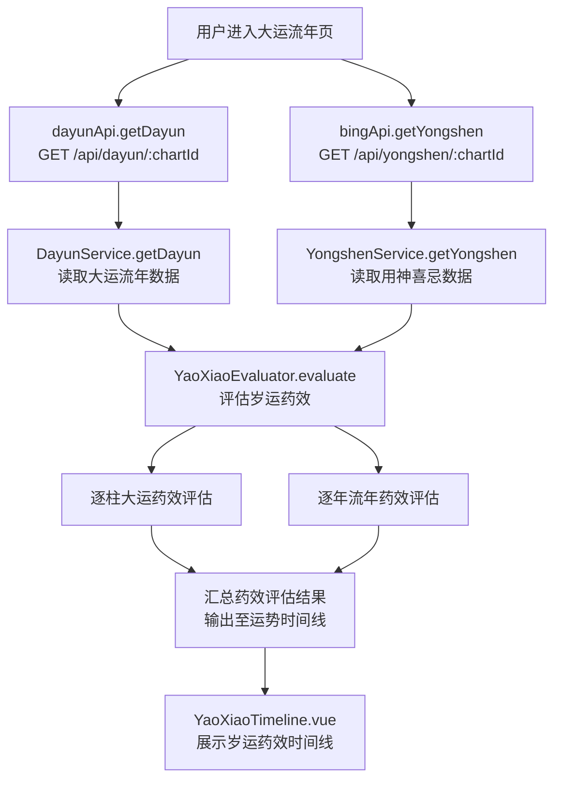
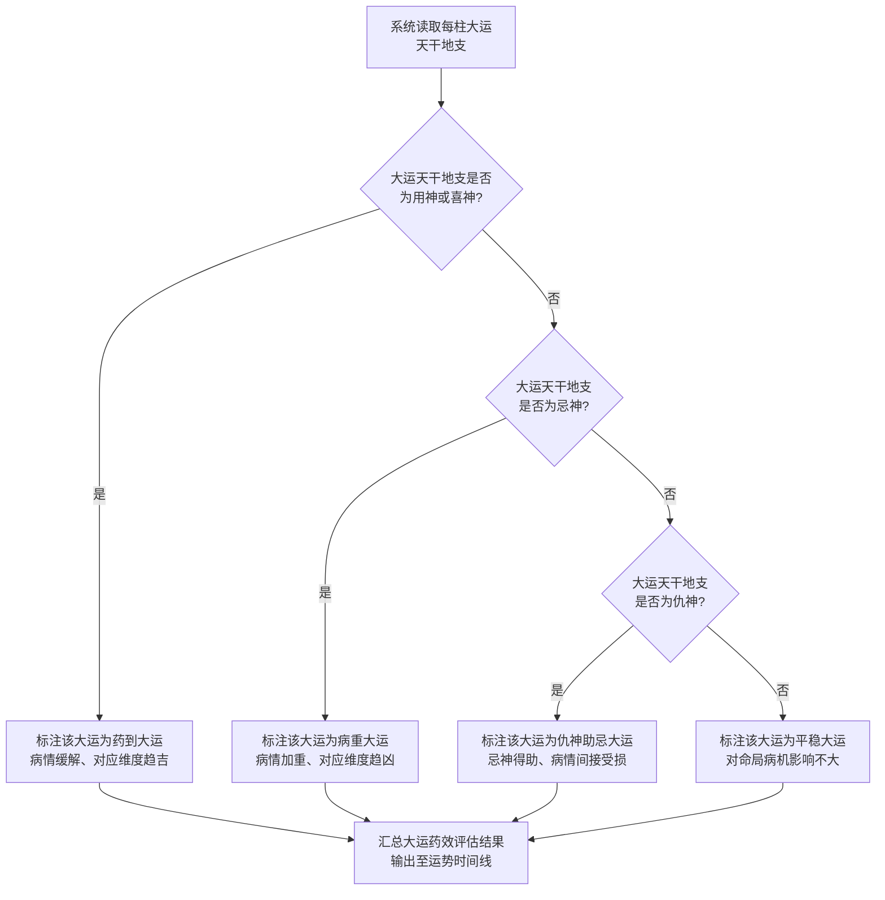
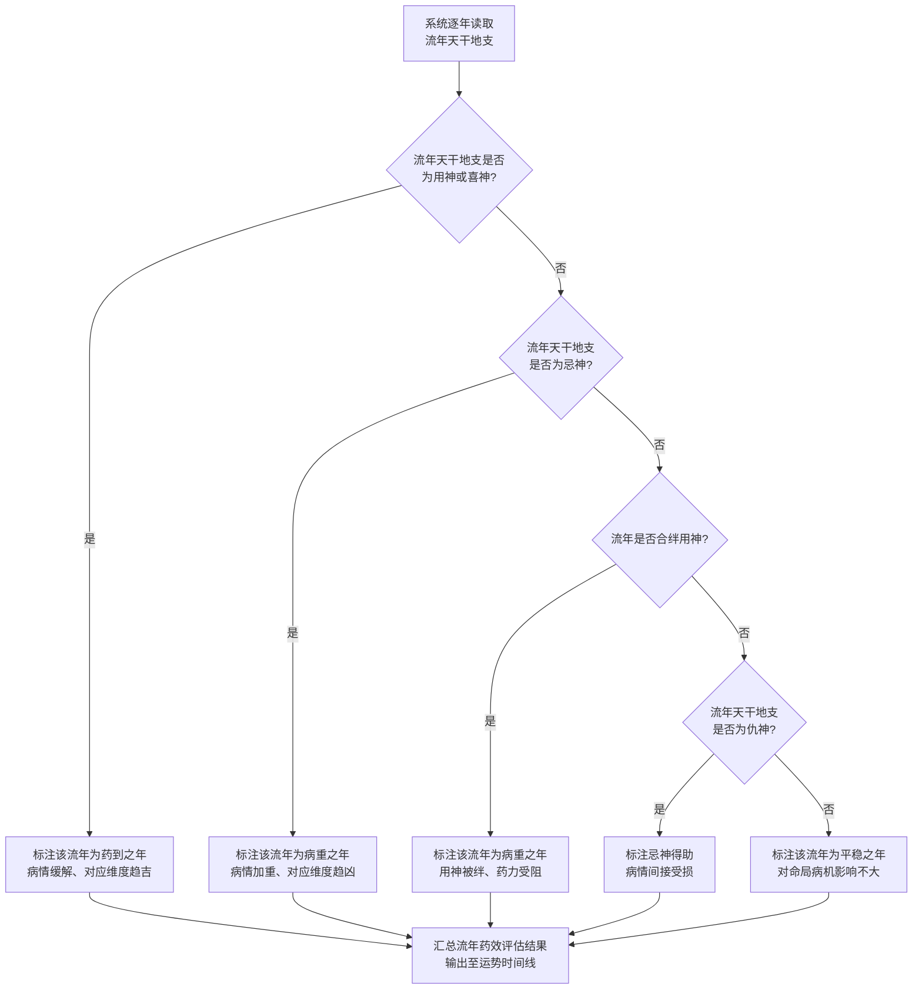
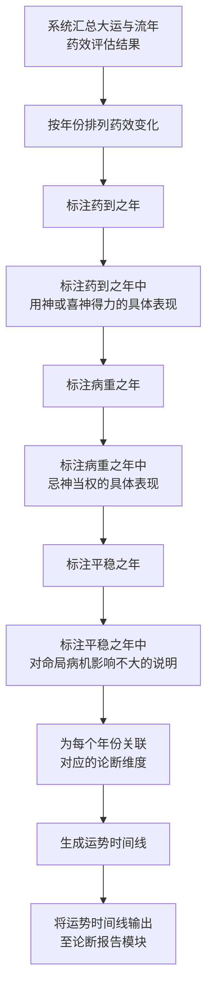
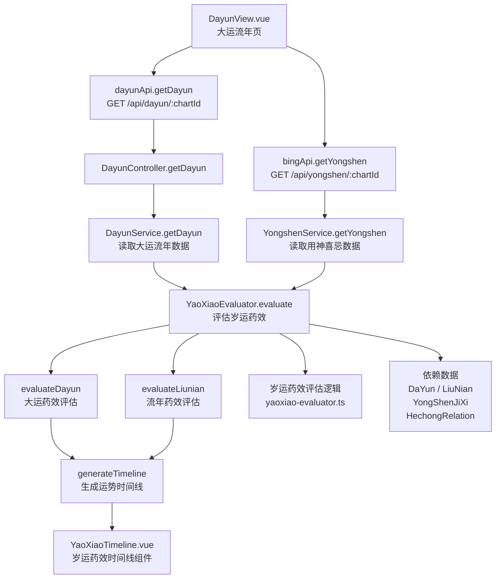

# 岁运药效评估

> PRD Reference: docs/PRD/04. 辨病与用神模块/04. 岁运药效评估/岁运药效评估.md#岁运药效评估

## 1. 业务流程

### 1.1 岁运药效评估主流程

**触发**：用户在大运流年页（`/dayun`）查看岁运药效时间线。

**步骤**：

1. 用户进入大运流年页，前端从 `useBingStore` 读取当前 `chartId` 与用神喜忌数据。
2. 前端调用 `dayunApi.getDayun()` 获取大运流年数据，同时调用 `bingApi.getYongshen()` 获取用神喜忌数据。
3. 前端 `YaoXiaoTimeline.vue` 组件将大运流年数据与用神喜忌数据结合，展示岁运药效时间线。
4. 后端 `DayunController.getDayun()` 返回大运流年数据时，调用 `YaoXiaoEvaluator` 将用神喜忌推导结果与岁运数据结合，在每柱大运和每年流年中标注药效变化。
5. 药效评估结果随大运流年数据一同返回，前端按年份排列展示运势时间线。

**预期结果**：用户可逐年查看药效变化时间线，标注药到之年、病重之年与平稳之年。



### 1.2 大运药效评估流程

**触发**：系统对每柱大运天干地支进行药效评估。

**步骤**：

1. `YaoXiaoEvaluator.evaluateDayun()` 逐柱读取大运天干地支。
2. 大运天干地支为用神或喜神 → 标注该大运为"药到大运"，标注病情缓解、对应维度趋吉。
3. 大运天干地支为忌神 → 标注该大运为"病重大运"，标注病情加重、对应维度趋凶。
4. 大运天干地支为仇神 → 标注该大运为"仇神助忌大运"，标注忌神得助、病情间接受损。
5. 大运天干地支为闲神 → 标注该大运为"平稳大运"，标注对命局病机影响不大。
6. 汇总大运药效评估结果，输出至运势时间线。

**预期结果**：每柱大运的药效评估结果清晰，标注药到/病重/仇神助忌/平稳。



### 1.3 流年药效评估流程

**触发**：系统对每年流年天干地支进行药效评估。

**步骤**：

1. `YaoXiaoEvaluator.evaluateLiunian()` 在大运药效评估基础上，逐年读取流年天干地支。
2. 流年天干地支为用神或喜神 → 标注该流年为"药到之年"，标注病情缓解、对应维度趋吉。
3. 流年天干地支为忌神 → 标注该流年为"病重之年"，标注病情加重、对应维度趋凶。
4. 流年合绊用神 → 标注该流年为"病重之年"，标注用神被绊、药力受阻。
5. 流年天干地支为仇神 → 标注忌神得助、病情间接受损。
6. 流年天干地支为闲神 → 标注该流年为"平稳之年"，标注对命局病机影响不大。
7. 汇总流年药效评估结果，输出至运势时间线。

**预期结果**：每年流年的药效评估结果清晰，标注药到/病重/平稳之年。



### 1.4 运势时间线生成流程

**触发**：系统汇总大运与流年药效评估结果后，生成运势时间线。

**步骤**：

1. 系统汇总大运与流年药效评估结果。
2. 按年份排列药效变化，标注药到之年、病重之年、平稳之年。
3. 为药到之年标注用神或喜神得力的具体表现。
4. 为病重之年标注忌神当权的具体表现。
5. 为平稳之年标注对命局病机影响不大的说明。
6. 为每个年份关联对应的论断维度（性格、事业、财运、婚姻、健康、学业）。
7. 生成运势时间线。
8. 将运势时间线输出至论断报告模块。

**预期结果**：运势时间线完整展示逐年药效变化与论断维度关联。



## 2. 关键函数设计

### 2.1 YaoXiaoEvaluator.evaluate

```typescript
function evaluate(dayunList: DaYun[], liunianList: LiuNian[], yongShenJiXi: YongShenJiXi, hechong: HechongRelation): YaoXiaoResult
```

- **职责**：综合评估岁运药效，对每柱大运和每年流年标注药效变化。
- **核心逻辑**：
  1. 调用 `evaluateDayun()` 对每柱大运天干地支进行药效评估。
  2. 调用 `evaluateLiunian()` 对每年流年天干地支进行药效评估。
  3. 调用 `generateTimeline()` 汇总生成运势时间线。
  4. 返回岁运药效评估结果。
- **PRD 追溯**：岁运药效总览页 — FR-07

### 2.2 evaluateDayun

```typescript
function evaluateDayun(dayunList: DaYun[], yongShenJiXi: YongShenJiXi): DayunYaoXiao[]
```

- **职责**：对每柱大运天干地支进行药效评估。
- **核心逻辑**：
  1. 遍历每柱大运天干地支。
  2. 判断大运天干地支五行与十神是否属于用神、喜神、忌神、仇神或闲神。
  3. 标注药效类型：药到大运/病重大运/仇神助忌大运/平稳大运。
  4. 标注对应论断维度的影响方向（趋吉/趋凶/平稳）。
  5. 返回每柱大运的药效评估列表。
- **PRD 追溯**：大运药效详情页 — FR-07

### 2.3 evaluateLiunian

```typescript
function evaluateLiunian(liunianList: LiuNian[], yongShenJiXi: YongShenJiXi, hechong: HechongRelation): LiunianYaoXiao[]
```

- **职责**：对每年流年天干地支进行药效评估。
- **核心逻辑**：
  1. 遍历每年流年天干地支。
  2. 判断流年天干地支五行与十神是否属于用神、喜神、忌神、仇神或闲神。
  3. 额外判断流年是否合绊用神（结合合冲刑害数据）。
  4. 标注药效类型：药到之年/病重之年/平稳之年。
  5. 标注用神被绊情况。
  6. 返回每年流年的药效评估列表。
- **PRD 追溯**：流年药效详情页 — FR-07

### 2.4 generateTimeline

```typescript
function generateTimeline(dayunYaoXiao: DayunYaoXiao[], liunianYaoXiao: LiunianYaoXiao[], jiXiong: JiXiongVerdict): TimelineResult
```

- **职责**：汇总大运与流年药效评估结果，生成运势时间线。
- **核心逻辑**：
  1. 按年份排列药效变化。
  2. 为每个年份关联对应的论断维度（性格、事业、财运、婚姻、健康、学业）。
  3. 为药到之年、病重之年、平稳之年分别标注具体表现。
  4. 返回运势时间线。
- **PRD 追溯**：运势时间线页 — FR-07

## 3. 组件架构



## 4. 数据来源

- 岁运药效综合评估逻辑：`code/backend/src/modules/bing/lib/yaoxiao-evaluator.ts`
- 大运流年数据：通过 `chartId` 引用模块 06 的 `DaYun` 与 `LiuNian` 表
- 用神喜忌数据：通过 `chartId` 引用本模块 `YongShenJiXi` 表
- 合冲刑害数据：通过 `chartId` 引用模块 03 的 `HechongRelation` 表（流年合绊用神判断）
- 吉凶论断数据：通过 `chartId` 引用本模块 `JiXiongVerdict` 表（论断维度关联）
- 术语定义：`0.common/glossary.md`（药效、药到之年、病重之年等术语）