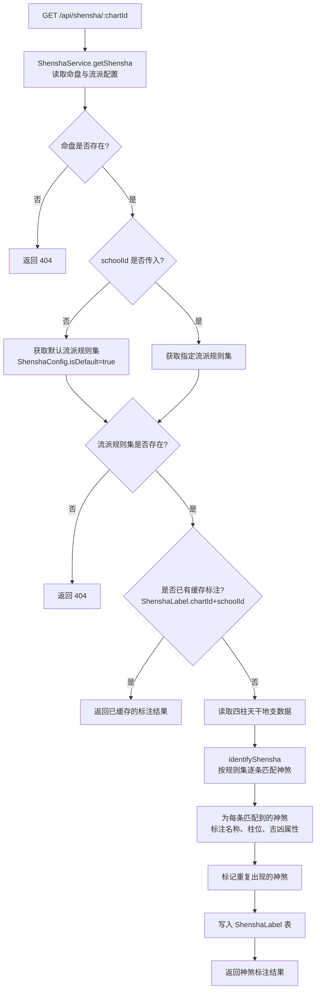
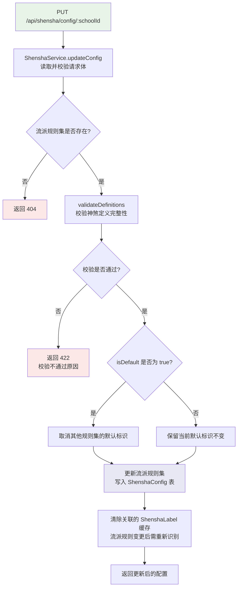

# API 设计 — 05. 神煞标注模块

## 概述

本模块提供三组 REST API，支撑神煞识别与标注、神煞配置管理两个子模块的前后端交互。神煞识别端点根据四柱天干地支组合与当前生效的神煞规则集，逐柱标注命局中的神煞；神煞配置管理端点支持按流派管理规则集与神煞定义。

根据 `code-structure.md §4` 与 `§5.6`，本模块的三个端点分别为神煞识别标注、获取配置与更新配置。所有端点遵循 `code-structure.md §4` 的路径与处理器约定，错误响应遵循 ADR-003（RFC7807 `application/problem+json`）。

## 1. 子模块 API 汇总

### 1.1 神煞识别与标注

| 方法 | 路径 | PRD 业务功能 | 说明 |
|------|------|-------------|------|
| GET | `/api/shensha/:chartId` | 命盘神煞标注、神煞详情说明、流派切换查看 | 获取命盘在指定流派下的神煞标注结果，支持按流派切换重新识别 |

### 1.2 神煞配置管理

| 方法 | 路径 | PRD 业务功能 | 说明 |
|------|------|-------------|------|
| GET | `/api/shensha/config` | 流派规则集列表、神煞定义列表、按吉凶属性筛选神煞定义 | 获取所有流派规则集及其神煞定义列表 |
| PUT | `/api/shensha/config/:schoolId` | 新增流派规则集、编辑流派规则集、删除流派规则集、设置默认流派规则集、新增神煞定义、编辑神煞定义、删除神煞定义、神煞定义启停、校验识别条件 | 更新指定流派规则集的神煞配置（含定义增删改与启停） |

## 2. 端点详情

### 2.1 GET /api/shensha/:chartId

**处理器**：`ShenshaController.getShensha()`
**服务**：`ShenshaService`
**PRD 追溯**：在四柱排盘的每一柱旁显示该柱所含的神煞标签、点击神煞标签弹出含义解释与判断要点、显示神煞的吉凶属性、标注同一神煞是否多次出现、流派切换后刷新神煞标注结果、展示所选神煞的名称别名与来源经典、说明该神煞的识别规则、描述该神煞的吉凶含义与在命局中的作用、标注该神煞与当前命盘其他要素的关联

#### 请求

| 字段 | 类型 | 必填 | 约束 | 示例 |
|------|------|------|------|------|
| chartId | Int | 是 | 路径参数，有效命盘 ID | `1` |
| schoolId | Int | 否 | 查询参数，流派规则集 ID。未传则使用默认流派 | `2` |

#### 响应（200 OK）

| 字段 | 类型 | 说明 | 示例 |
|------|------|------|------|
| chartId | Int | 命盘 ID | `1` |
| schoolId | Int | 所用流派规则集 ID | `2` |
| schoolName | String | 所用流派规则集名称 | `"子平法"` |
| labels | Array | 识别的神煞标注列表 | 见 `00.database-design.md` 中 labels JSON 结构定义 |
| createdAt | String (ISO 8601) | 创建时间 | `"2024-01-01T00:00:00Z"` |

**labels 数组中同一神煞名出现多次时，`duplicateCount` 字段大于 1 表示该神煞在命盘中多处出现（如双天乙贵人），前端据此展示"双天乙贵人"等标注。**

#### 错误响应

| HTTP 状态码 | 错误类型 | 说明 |
|------------|---------|------|
| 404 | `https://bazi.app/errors/chart-not-found` | 命盘 ID 不存在 |
| 404 | `https://bazi.app/errors/shensha-config-not-found` | 指定的流派规则集不存在（schoolId 无效或已删除） |
| 422 | `https://bazi.app/errors/pillars-not-calculated` | 四柱数据尚未计算（神煞识别依赖排盘数据） |
| 500 | `https://bazi.app/errors/shensha-identification-failed` | 神煞识别计算内部错误 |

#### 流程图



### 2.2 GET /api/shensha/config

**处理器**：`ShenshaController.getConfig()`
**服务**：`ShenshaService`
**PRD 追溯**：展示所有流派规则集的名称与说明、展示当前流派规则集下所有神煞定义的名称与吉凶属性、按吉凶属性筛选神煞定义

#### 请求

| 字段 | 类型 | 必填 | 约束 | 示例 |
|------|------|------|------|------|
| attribute | String | 否 | 查询参数，按吉凶属性筛选定义（`"吉神"` / `"凶煞"`）。未传则返回全部定义 | `"吉神"` |

#### 响应（200 OK）

| 字段 | 类型 | 说明 | 示例 |
|------|------|------|------|
| configs | Array | 流派规则集列表 | 见下方 configs 结构定义 |

**configs 数组元素结构**：

| 字段 | 类型 | 说明 | 示例 |
|------|------|------|------|
| id | Int | 流派规则集 ID | `1` |
| name | String | 流派名称 | `"子平法"` |
| description | String? | 流派说明 | `"传统子平法神煞规则集"` |
| isDefault | Boolean | 是否为默认生效规则集 | `true` |
| definitions | Array | 神煞定义列表（若请求指定了 `attribute` 筛选，则仅返回匹配项） | 见 `00.database-design.md` 中 definitions JSON 结构定义 |
| createdAt | String (ISO 8601) | 创建时间 | `"2024-01-01T00:00:00Z"` |

#### 错误响应

| HTTP 状态码 | 错误类型 | 说明 |
|------------|---------|------|
| 500 | `https://bazi.app/errors/shensha-config-fetch-failed` | 获取配置内部错误 |

### 2.3 PUT /api/shensha/config/:schoolId

**处理器**：`ShenshaController.updateConfig()`
**服务**：`ShenshaService`
**PRD 追溯**：新增流派规则集、编辑流派规则集、删除流派规则集、设置默认流派规则集、新增神煞定义、编辑神煞定义、删除神煞定义、神煞定义启停、校验识别条件格式正确性与完整性

#### 请求

| 字段 | 类型 | 必填 | 约束 | 示例 |
|------|------|------|------|------|
| schoolId | Int | 是 | 路径参数，流派规则集 ID | `1` |

**请求体**：

| 字段 | 类型 | 必填 | 约束 | 示例 |
|------|------|------|------|------|
| name | String | 是 | 流派名称，全局唯一，1–50 字符 | `"子平法"` |
| description | String | 否 | 流派说明，最多 500 字符 | `"传统子平法神煞规则集"` |
| isDefault | Boolean | 否 | 是否设为默认生效规则集。设为 `true` 时自动取消其他规则集的默认标识 | `true` |
| definitions | Array | 是 | 神煞定义列表，不可为空数组（至少包含一条定义） | 见 `00.database-design.md` 中 definitions JSON 结构定义 |

**definitions 数组中每条定义的必填字段校验**：

| 字段 | 约束 |
|------|------|
| id | 字符串，流派内唯一，不可为空 |
| name | 字符串，1–30 字符 |
| attribute | 枚举值 `"吉神"` 或 `"凶煞"` |
| isActive | 布尔值 |
| matchRules | 数组，不可为空；每条规则须包含 `type`、`description`、`scope` 字段 |

#### 响应（200 OK）

| 字段 | 类型 | 说明 | 示例 |
|------|------|------|------|
| id | Int | 流派规则集 ID | `1` |
| name | String | 流派名称 | `"子平法"` |
| description | String? | 流派说明 | `"传统子平法神煞规则集"` |
| isDefault | Boolean | 是否为默认生效规则集 | `true` |
| definitions | Array | 更新后的神煞定义列表 | 见 `00.database-design.md` 中 definitions JSON 结构定义 |
| createdAt | String (ISO 8601) | 创建时间 | `"2024-01-01T00:00:00Z"` |
| updatedAt | String (ISO 8601) | 更新时间 | `"2024-01-15T00:00:00Z"` |

#### 错误响应

| HTTP 状态码 | 错误类型 | 说明 |
|------------|---------|------|
| 404 | `https://bazi.app/errors/shensha-config-not-found` | 流派规则集不存在 |
| 422 | `https://bazi.app/errors/invalid-definitions` | 神煞定义校验不通过（定义 ID 重复、必填字段缺失、matchRules 格式错误等） |
| 422 | `https://bazi.app/errors/duplicate-school-name` | 流派名称与已有规则集重名 |
| 500 | `https://bazi.app/errors/shensha-config-update-failed` | 配置更新内部错误 |

#### 流程图



## 3. 数据模型映射

| 端点 | 读取表 | 写入表 | 说明 |
|------|--------|--------|------|
| `GET /api/shensha/:chartId` | Chart, Pillar, ShenshaConfig | ShenshaLabel | 读取排盘数据与流派规则集，执行神煞识别并缓存标注结果 |
| `GET /api/shensha/config` | ShenshaConfig | — | 读取所有流派规则集及其神煞定义 |
| `PUT /api/shensha/config/:schoolId` | ShenshaConfig | ShenshaConfig, ShenshaLabel（清除缓存） | 更新流派规则集配置，校验定义完整性，必要时清除关联标注缓存 |

## 4. 错误处理总则

所有错误响应遵循 ADR-003（RFC7807 `application/problem+json`）：

```json
{
  "type": "https://bazi.app/errors/chart-not-found",
  "title": "命盘不存在",
  "status": 404,
  "detail": "chartId=999 对应的命盘记录不存在"
}
```

| HTTP 状态码 | 适用场景 |
|------------|----------|
| 404 | 命盘 ID 不存在、流派规则集不存在 |
| 422 | 前置依赖数据尚未计算（四柱数据）、神煞定义校验不通过、流派名称重复 |
| 500 | 神煞识别计算内部错误、配置更新内部错误 |

## 5. 跨模块依赖

| 依赖方向 | 说明 |
|----------|------|
| 本模块 → 模块 01（八字排盘与历法） | 通过 `chartId` 引用 Chart + Pillar 数据，读取四柱天干地支作为神煞识别的基础输入 |
| 模块 04（辨病与用神） → 本模块 | 通过 `chartId` 引用 ShenshaLabel 数据，学业文昌论断读取文昌等学业神煞 |
| 模块 07（论断报告） → 本模块 | 论断报告模块引用本模块的神煞标注数据作为报告章节数据来源 |