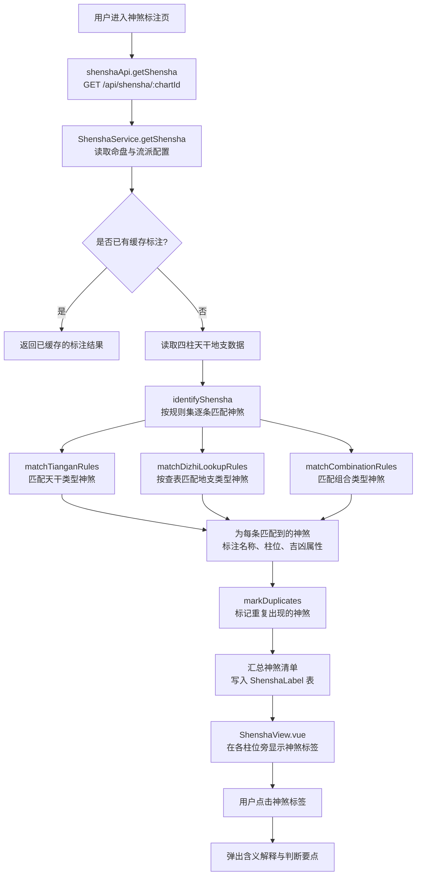
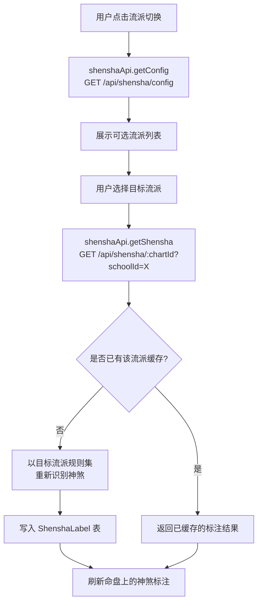
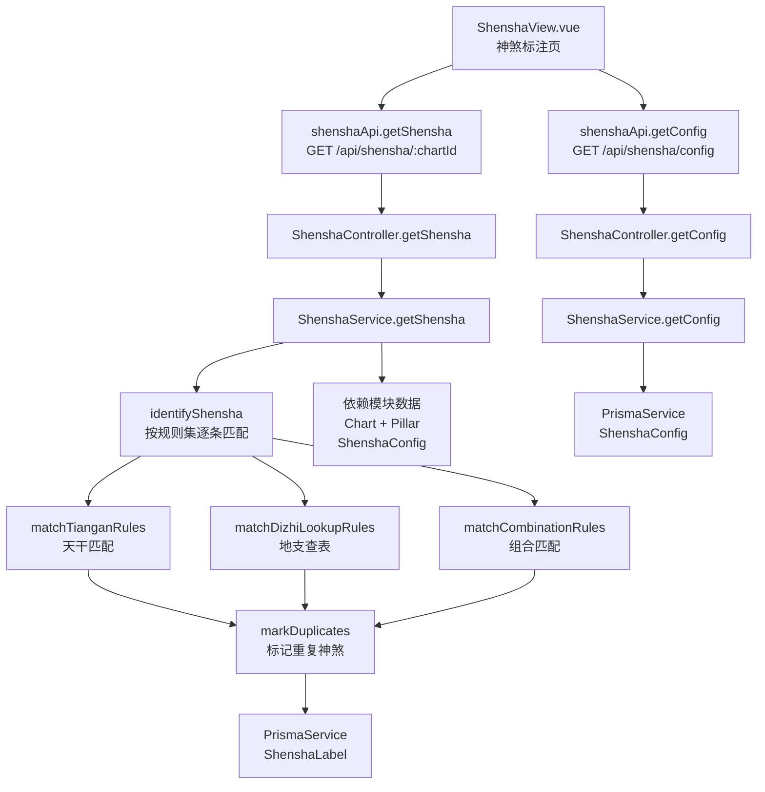

# 神煞识别与标注

> PRD Reference: docs/PRD/05. 神煞标注模块/01. 神煞识别与标注/神煞识别与标注.md#神煞识别与标注

## 1. 业务流程

### 1.1 神煞识别流程

**触发**：用户在神煞标注页（`/shensha`）查看命盘的神煞标注结果。

**步骤**：

1. 用户进入神煞标注页，前端从 `useShenshaStore` 读取当前 `chartId`。
2. 前端调用 `shenshaApi.getShensha()` 发送 `GET /api/shensha/:chartId` 请求（不传 `schoolId` 时使用默认流派）。
3. 后端 `ShenshaController.getShensha()` 接收请求，`ShenshaService.getShensha()` 执行神煞识别：
   - 查询 `ShenshaLabel` 表是否已有该命盘在当前流派下的标注缓存。
   - 若已缓存，直接返回标注结果。
   - 若未缓存，读取 `Chart` + `Pillar` 表获取四柱天干地支数据。
4. 调用 `identifyShensha()` 按当前流派规则集逐条匹配神煞：
   - 调用 `matchTianganRules()` 匹配天干类型神煞。
   - 调用 `matchDizhiLookupRules()` 按查表匹配地支类型神煞。
   - 调用 `matchCombinationRules()` 匹配天干地支组合类型神煞。
5. 为每条匹配到的神煞标注名称、所在柱位、吉凶属性与含义说明。
6. 调用 `markDuplicates()` 标记同一神煞在命盘中的多次出现（如双天乙贵人）。
7. 系统汇总神煞清单，写入 `ShenshaLabel` 表。
8. 前端 `ShenshaView.vue` 在四柱排盘各柱位旁显示已识别的神煞标签。
9. 用户点击某一神煞标签，前端弹出该神煞的含义解释、识别规则与判断要点。

**预期结果**：用户可查看命盘中所有神煞的标注结果，包括名称、柱位、吉凶属性与含义说明。



### 1.2 切换流派查看流程

**触发**：命理从业者在命盘页面点击流派切换，查看同一命盘在不同流派下的神煞标注差异。

**步骤**：

1. 用户在神煞标注页点击流派切换控件。
2. 前端调用 `shenshaApi.getConfig()` 发送 `GET /api/shensha/config` 请求，获取可选流派列表。
3. 系统展示可选流派列表（含流派名称、说明、是否为默认流派）。
4. 用户选择目标流派，前端记录选中的 `schoolId`。
5. 前端调用 `shenshaApi.getShensha()` 发送 `GET /api/shensha/:chartId?schoolId=X` 请求。
6. 后端以目标流派的神煞规则集重新识别：
   - 查询 `ShenshaLabel` 表是否已有该命盘在目标流派下的标注缓存。
   - 若已缓存，直接返回标注结果。
   - 若未缓存，读取目标流派的 `ShenshaConfig` 规则集，执行步骤 1.1 中的识别流程。
7. 系统刷新命盘上的神煞标注，显示新流派下的标注结果。

**预期结果**：用户可对比同一命盘在不同流派下的神煞标注差异。



## 2. 关键函数设计

### 2.1 ShenshaService.getShensha

```typescript
async function getShensha(chartId: number, schoolId?: number): Promise<ShenshaLabelResult>
```

- **职责**：接收命盘 ID 与可选流派 ID，执行神煞识别并返回标注结果。
- **核心逻辑**：
  1. 按 `chartId` 查询 `Chart` 表，验证命盘存在。
  2. 若未传入 `schoolId`，查询 `ShenshaConfig` 表中 `isDefault = true` 的默认流派。
  3. 若传入了 `schoolId`，查询对应的 `ShenshaConfig` 记录。
  4. 查询 `ShenshaLabel` 表是否已有该命盘在当前流派下的标注缓存。
  5. 若已缓存，直接返回标注结果。
  6. 若未缓存，读取 `Pillar` 表获取四柱天干地支数据。
  7. 调用 `identifyShensha()` 按当前流派规则集逐条匹配神煞。
  8. 调用 `markDuplicates()` 标记重复出现的神煞。
  9. 写入 `ShenshaLabel` 表并返回结果。
- **PRD 追溯**：命盘神煞标注、流派切换查看 — FR-05

### 2.2 identifyShensha

```typescript
function identifyShensha(pillars: Pillar[], config: ShenshaConfig): ShenshaLabelItem[]
```

- **职责**：按指定流派规则集的四柱天干地支数据，逐条匹配所有启用的神煞定义，返回识别到的神煞标注列表。
- **核心逻辑**：
  1. 从 `config.definitions` 中筛选 `isActive = true` 的神煞定义。
  2. 遍历每条启用的定义，调用 `matchDefinition()` 判断该神煞是否在命盘中出现。
  3. 对匹配成功的定义，构建 `ShenshaLabelItem`：包含名称、别名、柱位、具体位置、天干地支、吉凶属性、含义说明。
  4. 汇总所有匹配结果并返回。
- **PRD 追溯**：在四柱排盘的每一柱旁显示该柱所含的神煞标签 — FR-05

### 2.3 matchDefinition

```typescript
function matchDefinition(pillars: Pillar[], definition: ShenshaDefinition): ShenshaLabelItem | null
```

- **职责**：判断单条神煞定义是否在命盘中匹配，返回标注项或 null。
- **核心逻辑**：
  1. 读取定义的 `matchRules` 数组。
  2. 根据 `matchRules.type` 分派到不同的匹配函数：
     - `"tiangan_match"` → 调用 `matchTianganRules()`。
     - `"dizhi_lookup"` → 调用 `matchDizhiLookupRules()`。
     - `"combination_match"` → 调用 `matchCombinationRules()`。
  3. 若任意规则匹配成功，构建标注项并返回。
  4. 若全部规则匹配失败，返回 null。
- **PRD 追溯**：说明该神煞的识别规则 — FR-05

### 2.4 matchTianganRules

```typescript
function matchTianganRules(pillars: Pillar[], rule: MatchRule): ShenshaLabelItem | null
```

- **职责**：基于天干匹配规则识别神煞。
- **核心逻辑**：
  1. 从四柱天干中提取指定位置的天干。
  2. 判断天干是否满足规则条件（如日干为甲且年干见禄后一位）。
  3. 若匹配成功，返回标注项；否则返回 null。
- **PRD 追溯**：基于天干的识别规则匹配 — FR-05

### 2.5 matchDizhiLookupRules

```typescript
function matchDizhiLookupRules(pillars: Pillar[], rule: MatchRule): ShenshaLabelItem | null
```

- **职责**：基于地支查表规则识别神煞（如天乙贵人、驿马等）。
- **核心逻辑**：
  1. 从四柱中提取指定范围的地支（如年支、日支）。
  2. 以查表规则中的 `lookupTable` 为依据，按日干查对应地支。
  3. 若命盘地支中包含查表结果中的任意地支，则匹配成功。
  4. 构建标注项并返回。
- **PRD 追溯**：基于地支查表的识别规则匹配 — FR-05

### 2.6 matchCombinationRules

```typescript
function matchCombinationRules(pillars: Pillar[], rule: MatchRule): ShenshaLabelItem | null
```

- **职责**：基于天干地支组合规则识别神煞（如华盖、将星等）。
- **核心逻辑**：
  1. 从四柱中提取天干与地支的组合关系。
  2. 判断组合是否满足规则条件（如年支或日支见三合局末位地支）。
  3. 若匹配成功，构建标注项并返回；否则返回 null。
- **PRD 追溯**：基于天干地支组合的识别规则匹配 — FR-05

### 2.7 markDuplicates

```typescript
function markDuplicates(labels: ShenshaLabelItem[]): ShenshaLabelItem[]
```

- **职责**：标记同一神煞在命盘中的多次出现。
- **核心逻辑**：
  1. 按 `name` 字段对标注列表分组。
  2. 对出现次数大于 1 的神煞，在每条标注项中设置 `duplicateCount` 为实际出现次数。
  3. 对仅出现 1 次的神煞，设置 `duplicateCount` 为 1。
  4. 返回标注后的列表。
- **PRD 追溯**：标注同一神煞是否多次出现（如双天乙贵人） — FR-05

## 3. 组件架构



## 4. 数据来源

- 神煞识别规则引擎：`code/backend/src/modules/shensha/lib/shensha-rules.ts`
- 神煞配置 CRUD 逻辑：`code/backend/src/modules/shensha/lib/config-manager.ts`
- 排盘数据：通过 `chartId` 引用模块 01 的 `Chart` + `Pillar` 表
- 流派配置：本模块 `ShenshaConfig` 表
- 术语定义：`0.common/glossary.md`（神煞、天乙贵人、驿马等术语）