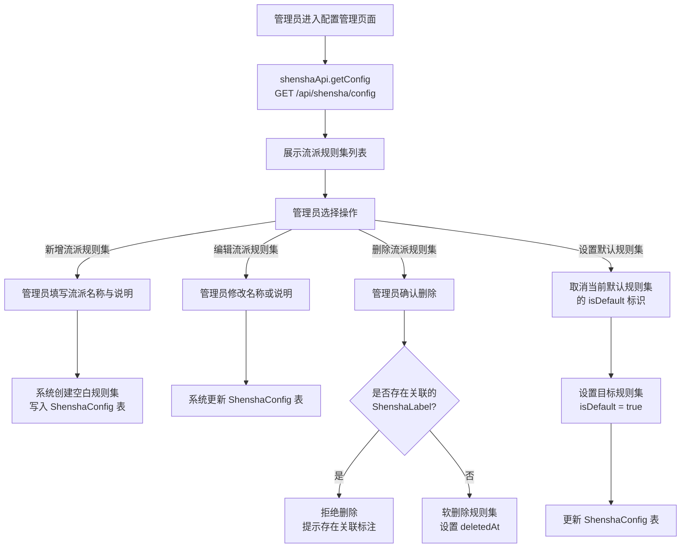
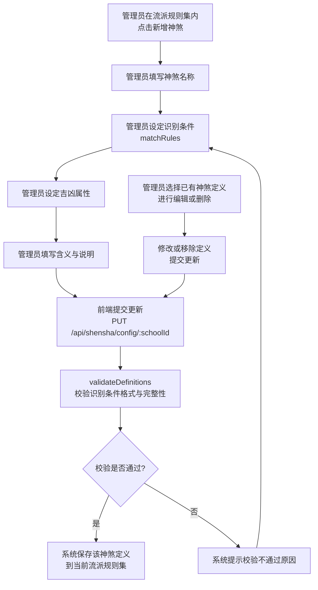
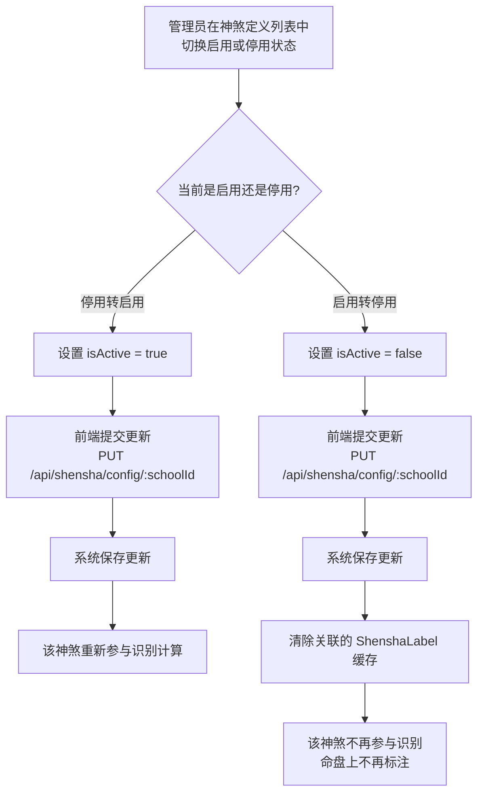
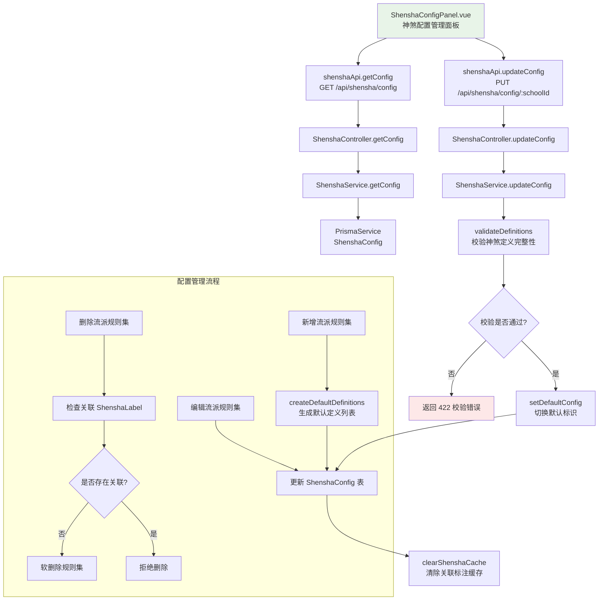

# 神煞配置管理

> PRD Reference: docs/PRD/05. 神煞标注模块/02. 神煞配置管理/神煞配置管理.md#神煞配置管理

## 1. 业务流程

### 1.1 流派规则集管理流程

**触发**：系统管理员进入神煞配置管理页面，管理流派规则集。

**步骤**：

1. 管理员进入神煞配置管理页面，前端调用 `shenshaApi.getConfig()` 发送 `GET /api/shensha/config` 请求。
2. 后端 `ShenshaController.getConfig()` 接收请求，`ShenshaService.getConfig()` 返回所有流派规则集列表。
3. 系统展示当前已有的流派规则集列表（含名称、说明、是否为默认规则集）。
4. 管理员选择操作：
   - **新增流派规则集**：管理员填写流派名称与说明，系统创建空白规则集（`definitions` 为包含默认神煞定义的初始列表），写入 `ShenshaConfig` 表。
   - **编辑流派规则集**：管理员修改流派名称或说明，系统更新 `ShenshaConfig` 表对应记录。
   - **删除流派规则集**：管理员确认删除，系统检查该规则集下是否存在关联的 `ShenshaLabel` 记录；若存在则拒绝删除并提示，否则软删除该规则集（设置 `deletedAt`）。
   - **设置默认流派规则集**：管理员将某一流派规则集设为默认，系统先将当前默认规则集的 `isDefault` 置为 `false`，再将目标规则集的 `isDefault` 置为 `true`。

**预期结果**：管理员可对流派规则集进行增删改与默认设置操作。



### 1.2 神煞定义增删改流程

**触发**：管理员在某一流派规则集内对单条神煞定义进行增删改操作。

**步骤**：

1. 管理员在流派规则集内点击新增神煞，前端展示神煞定义编辑表单。
2. 管理员填写神煞名称与别名。
3. 管理员设定识别条件：基于天干、地支或天干地支组合的匹配规则（`matchRules`）。
4. 管理员设定吉凶属性（`"吉神"` 或 `"凶煞"`）。
5. 管理员填写神煞含义与判断要点说明。
6. 前端调用 `shenshaApi.updateConfig()` 发送 `PUT /api/shensha/config/:schoolId` 请求，请求体包含更新后的完整 `definitions` 数组。
7. 后端 `ShenshaService.updateConfig()` 调用 `validateDefinitions()` 校验识别条件格式与完整性：
   - 每条定义的 `id` 在流派内唯一。
   - 每条定义的 `name` 不为空。
   - 每条定义的 `attribute` 为 `"吉神"` 或 `"凶煞"`。
   - 每条定义的 `matchRules` 数组不为空，且每条规则包含有效的 `type`、`description`、`scope` 字段。
   - `"dizhi_lookup"` 类型的规则必须包含 `lookupTable`。
8. 校验通过后，系统保存该神煞定义到当前流派规则集的 `definitions` 数组中。
9. 管理员选择已有神煞定义进行编辑：修改识别条件、吉凶属性或说明，重新提交并校验。
10. 管理员选择已有神煞定义进行删除：从 `definitions` 数组中移除该定义，提交更新。

**预期结果**：管理员可在流派规则集内对神煞定义进行增删改操作，识别条件经过格式校验。



### 1.3 神煞定义启停流程

**触发**：管理员在神煞定义列表中切换某条定义的启用或停用状态。

**步骤**：

1. 管理员在神煞定义列表中点击启用或停用开关。
2. 前端修改该定义的 `isActive` 字段（启用转停用设为 `false`，停用转启用设为 `true`）。
3. 前端调用 `shenshaApi.updateConfig()` 发送 `PUT /api/shensha/config/:schoolId` 请求，请求体包含更新后的完整 `definitions` 数组。
4. 后端校验并保存更新。
5. 若为停用操作：该神煞不再参与识别计算，命盘上不再标注此神煞。已有的 `ShenshaLabel` 缓存需要清除（因为规则集变更后标注结果可能不同）。
6. 若为启用操作：该神煞重新参与识别计算，下次查询神煞标注时会重新识别。

**预期结果**：管理员可随时启停神煞定义，停用后该神煞不参与识别，启用后重新参与识别。



## 2. 关键函数设计

### 2.1 ShenshaService.getConfig

```typescript
async function getConfig(attribute?: string): Promise<ShenshaConfigResult[]>
```

- **职责**：获取所有流派规则集及其神煞定义列表，支持按吉凶属性筛选定义。
- **核心逻辑**：
  1. 查询 `ShenshaConfig` 表中所有未软删除的规则集记录。
  2. 若传入 `attribute` 参数，对每条规则集的 `definitions` 数组按 `attribute` 字段筛选。
  3. 返回规则集列表（含 ID、名称、说明、是否默认、定义列表、创建时间）。
- **PRD 追溯**：流派规则集列表、神煞定义列表、按吉凶属性筛选神煞定义 — FR-05

### 2.2 ShenshaService.updateConfig

```typescript
async function updateConfig(schoolId: number, data: UpdateShenshaConfigDto): Promise<ShenshaConfigResult>
```

- **职责**：更新指定流派规则集的神煞配置（含定义增删改与启停、流派元信息修改、默认标识切换）。
- **核心逻辑**：
  1. 按 `schoolId` 查询 `ShenshaConfig` 表，验证规则集存在且未软删除。
  2. 校验 `name` 是否与已有规则集重名（排除自身）。
  3. 调用 `validateDefinitions()` 校验 `definitions` 数组中每条定义的完整性。
  4. 若 `isDefault` 为 `true`，先将所有其他规则集的 `isDefault` 置为 `false`。
  5. 更新 `ShenshaConfig` 表对应记录。
  6. 清除关联的 `ShenshaLabel` 缓存（删除 `ShenshaLabel` 中 `schoolId` 等于当前规则集 ID 的记录），因为规则集变更后标注结果可能不同。
  7. 返回更新后的配置。
- **PRD 追溯**：新增流派规则集、编辑流派规则集、删除流派规则集、设置默认流派规则集、新增神煞定义、编辑神煞定义、删除神煞定义、神煞定义启停、校验识别条件 — FR-05

### 2.3 validateDefinitions

```typescript
function validateDefinitions(definitions: ShenshaDefinitionItem[]): ValidationResult
```

- **职责**：校验神煞定义列表的完整性与格式正确性。
- **核心逻辑**：
  1. 检查 `definitions` 数组不为空（至少包含一条定义）。
  2. 遍历每条定义，检查必填字段：`id`（流派内唯一）、`name`（非空）、`attribute`（`"吉神"` 或 `"凶煞"`）、`isActive`（布尔值）、`matchRules`（非空数组）。
  3. 检查 `definitions` 中无重复 `id`。
  4. 遍历每条定义的 `matchRules`，检查每条规则包含有效 `type`（`"tiangan_match"` / `"dizhi_lookup"` / `"combination_match"`）、非空 `description`、非空 `scope` 数组。
  5. 对 `"dizhi_lookup"` 类型规则，检查 `lookupTable` 字段存在且包含有效天干键值对。
  6. 返回校验结果（成功 / 失败原因列表）。
- **PRD 追溯**：校验识别条件格式的正确性与完整性 — FR-05

### 2.4 setDefaultConfig

```typescript
async function setDefaultConfig(schoolId: number): Promise<void>
```

- **职责**：将指定流派规则集设为默认生效规则集，同时取消其他规则集的默认标识。
- **核心逻辑**：
  1. 查询当前 `isDefault = true` 的规则集，将其 `isDefault` 置为 `false`。
  2. 将目标规则集的 `isDefault` 置为 `true`。
  3. 两步操作在同一事务中执行，保证数据一致性。
- **PRD 追溯**：设置默认生效的流派规则集 — FR-05

### 2.5 clearShenshaCache

```typescript
async function clearShenshaCache(schoolId: number): Promise<void>
```

- **职责**：清除指定流派规则集关联的所有神煞标注缓存。
- **核心逻辑**：
  1. 删除 `ShenshaLabel` 表中 `schoolId` 等于指定规则集 ID 的所有记录（物理删除，非软删除，因为缓存数据无需保留历史版本）。
  2. 下次查询该规则集下的神煞标注时，系统会重新识别并生成新的缓存。
- **PRD 追溯**：流派规则集变更后清除缓存、神煞定义启停后清除缓存 — FR-05

### 2.6 ConfigManager.createDefaultDefinitions

```typescript
function createDefaultDefinitions(): ShenshaDefinitionItem[]
```

- **职责**：生成默认流派规则集的神煞定义初始列表。
- **核心逻辑**：
  1. 返回预设的常见神煞定义列表（天乙贵人、太极贵人、文昌、驿马、桃花、华盖、将星、羊刃、空亡等）。
  2. 每条定义包含 `id`、`name`、`aliases`、`attribute`、`description`、`isActive`（默认 `true`）、`matchRules`。
  3. 新创建的流派规则集可以此为起点进行增删改。
- **PRD 追溯**：新增流派规则集时创建空白规则集 — FR-05

## 3. 组件架构



## 4. 数据来源

- 神煞配置 CRUD 逻辑：`code/backend/src/modules/shensha/lib/config-manager.ts`
- 神煞识别规则引擎：`code/backend/src/modules/shensha/lib/shensha-rules.ts`
- 数据模型：`ShenshaConfig`（流派规则集配置）、`ShenshaLabel`（神煞标注缓存）
- 术语定义：`0.common/glossary.md`（神煞术语）