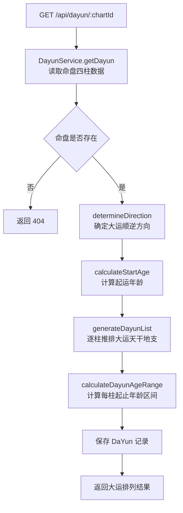
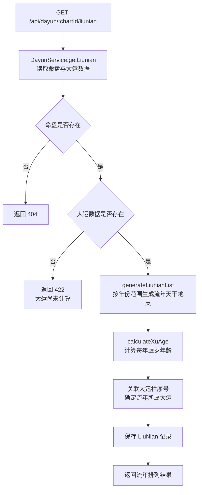
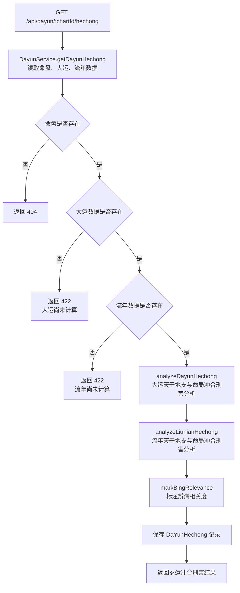

# API 设计 — 06. 大运流年模块

## 概述

本模块提供三组 REST API，支撑起运与大运排列、流年排列、岁运冲合刑害三个子模块的前后端交互。根据 `code-structure.md §4` 与 `§5.7`，本模块的三个端点分别为大运排列、流年排列与岁运冲合刑害标注。所有端点遵循 `code-structure.md §4` 的路径与处理器约定，错误响应遵循 ADR-003（RFC7807 `application/problem+json`）。

## 1. 子模块 API 汇总

### 1.1 起运与大运排列

| 方法 | 路径 | PRD 业务功能 | 说明 |
|------|------|-------------|------|
| GET | `/api/dayun/:chartId` | 查看起运年龄、查看大运顺逆方向、查看每柱大运天干地支、查看每柱大运起止年龄区间、查看大运天干地支的五行属性、查看大运天干地支与命局四柱的初步对照 | 获取命盘大运排列数据，包含起运年龄、顺逆方向与每柱大运详情 |

### 1.2 流年排列

| 方法 | 路径 | PRD 业务功能 | 说明 |
|------|------|-------------|------|
| GET | `/api/dayun/:chartId/liunian` | 查看当年流年天干地支、查看未来若干年流年天干地支列表、按年份范围筛选流年天干地支、查看流年天干地支的五行属性、查看流年天干地支与命局四柱的初步对照 | 获取命盘流年排列数据，包含每年流年天干地支、公历年份与虚岁年龄 |

### 1.3 岁运冲合刑害

| 方法 | 路径 | PRD 业务功能 | 说明 |
|------|------|-------------|------|
| GET | `/api/dayun/:chartId/hechong` | 查看大运与命局的冲合刑害关系列表、查看流年与命局的冲合刑害关系列表、查看冲合刑害关系的辨病相关度标注、查看每组冲合刑害涉及的命局柱位、查看每组冲合刑害涉及的五行、查看冲合刑害类型的辨病意义说明 | 获取命盘岁运冲合刑害数据，包含大运与流年对命局的冲合刑害关系及辨病相关度标注 |

## 2. 端点详情

### 2.1 GET /api/dayun/:chartId

**处理器**：`DayunController.getDayun()`
**服务**：`DayunService`
**PRD 追溯**：查看起运年龄、查看大运顺逆方向、查看每柱大运天干地支、查看每柱大运起止年龄区间、查看大运天干地支的五行属性、查看大运天干地支与命局四柱的初步对照

#### 请求

| 字段 | 类型 | 必填 | 约束 | 示例 |
|------|------|------|------|------|
| chartId | Int | 是 | 路径参数，有效命盘 ID | `1` |

#### 响应（200 OK）

| 字段 | 类型 | 说明 | 示例 |
|------|------|------|------|
| chartId | Int | 命盘 ID | `1` |
| startAge | Int | 起运年龄（岁） | `5` |
| direction | String | 大运顺逆方向 | `"顺排"` |
| dayunList | Array | 大运排列列表 | 见 `00.database-design.md` 中 dayunList JSON 结构定义 |
| createdAt | String (ISO 8601) | 创建时间 | `"2024-01-01T00:00:00Z"` |

#### 错误响应

| HTTP 状态码 | 错误类型 | 说明 |
|------------|---------|------|
| 404 | `https://bazi.app/errors/chart-not-found` | 命盘 ID 不存在 |
| 422 | `https://bazi.app/errors/chart-calculation-required` | 排盘计算尚未完成（需先调用排盘接口） |
| 500 | `https://bazi.app/errors/dayun-calculation-failed` | 大运计算内部错误 |

#### 流程图



### 2.2 GET /api/dayun/:chartId/liunian

**处理器**：`DayunController.getLiunian()`
**服务**：`DayunService`
**PRD 追溯**：查看当年流年天干地支、查看未来若干年流年天干地支列表、按年份范围筛选流年天干地支、查看流年天干地支的五行属性、查看流年天干地支与命局四柱的初步对照

#### 请求

| 字段 | 类型 | 必填 | 约束 | 示例 |
|------|------|------|------|------|
| chartId | Int | 是 | 路径参数，有效命盘 ID | `1` |
| startYear | Int | 否 | 查询参数，起始年份，默认当前年份 | `2024` |
| endYear | Int | 否 | 查询参数，终止年份，默认起始年份+20 | `2044` |

#### 响应（200 OK）

| 字段 | 类型 | 说明 | 示例 |
|------|------|------|------|
| chartId | Int | 命盘 ID | `1` |
| liunianList | Array | 流年排列列表 | 见 `00.database-design.md` 中 liunianList JSON 结构定义 |
| createdAt | String (ISO 8601) | 创建时间 | `"2024-01-01T00:00:00Z"` |

#### 错误响应

| HTTP 状态码 | 错误类型 | 说明 |
|------------|---------|------|
| 404 | `https://bazi.app/errors/chart-not-found` | 命盘 ID 不存在 |
| 422 | `https://bazi.app/errors/dayun-not-calculated` | 大运尚未计算（需先调用大运接口） |
| 422 | `https://bazi.app/errors/invalid-year-range` | 年份范围参数无效（startYear > endYear） |
| 500 | `https://bazi.app/errors/liunian-calculation-failed` | 流年计算内部错误 |

#### 流程图



### 2.3 GET /api/dayun/:chartId/hechong

**处理器**：`DayunController.getDayunHechong()`
**服务**：`DayunService`
**PRD 追溯**：查看大运与命局的冲合刑害关系列表、查看流年与命局的冲合刑害关系列表、查看冲合刑害关系的辨病相关度标注、查看每组冲合刑害涉及的命局柱位、查看每组冲合刑害涉及的五行、查看冲合刑害类型的辨病意义说明

#### 请求

| 字段 | 类型 | 必填 | 约束 | 示例 |
|------|------|------|------|------|
| chartId | Int | 是 | 路径参数，有效命盘 ID | `1` |

#### 响应（200 OK）

| 字段 | 类型 | 说明 | 示例 |
|------|------|------|------|
| chartId | Int | 命盘 ID | `1` |
| dayunHechong | Array | 大运冲合刑害标注结果 | 见 `00.database-design.md` 中 dayunHechong JSON 结构定义 |
| liunianHechong | Array | 流年冲合刑害标注结果 | 见 `00.database-design.md` 中 liunianHechong JSON 结构定义 |
| createdAt | String (ISO 8601) | 创建时间 | `"2024-01-01T00:00:00Z"` |

#### 错误响应

| HTTP 状态码 | 错误类型 | 说明 |
|------------|---------|------|
| 404 | `https://bazi.app/errors/chart-not-found` | 命盘 ID 不存在 |
| 422 | `https://bazi.app/errors/dayun-not-calculated` | 大运尚未计算（需先调用大运接口） |
| 422 | `https://bazi.app/errors/liunian-not-calculated` | 流年尚未计算（需先调用流年接口） |
| 500 | `https://bazi.app/errors/dayun-hechong-calculation-failed` | 岁运冲合刑害计算内部错误 |

#### 流程图



## 3. 数据模型映射

| 端点 | 读取表 | 写入表 | 说明 |
|------|--------|--------|------|
| `GET /api/dayun/:chartId` | Chart, Pillar | DaYun | 读取排盘数据，计算起运年龄与大运排列 |
| `GET /api/dayun/:chartId/liunian` | Chart, Pillar, DaYun | LiuNian | 读取排盘与大运数据，计算流年排列 |
| `GET /api/dayun/:chartId/hechong` | Chart, Pillar, DaYun, LiuNian, HechongRelation | DaYunHechong | 读取排盘、大运、流年与合冲刑害规则数据，计算岁运冲合刑害 |

## 4. 错误处理总则

所有错误响应遵循 ADR-003（RFC7807 `application/problem+json`）：

```json
{
  "type": "https://bazi.app/errors/chart-not-found",
  "title": "命盘不存在",
  "status": 404,
  "detail": "chartId=999 对应的命盘记录不存在"
}
```

| HTTP 状态码 | 适用场景 |
|------------|---------|
| 404 | 命盘 ID 不存在 |
| 422 | 前置依赖数据尚未计算（排盘、大运、流年）或参数无效 |
| 500 | 大运流年计算内部错误 |

## 5. 跨模块依赖

| 依赖方向 | 说明 |
|----------|------|
| 本模块 → 模块 01（八字排盘与历法） | 通过 `chartId` 引用 Chart + Pillar 数据，读取四柱天干地支、性别、出生时间作为起运计算与大运排列的输入 |
| 本模块 → 模块 03（合冲刑害） | 复用模块 03 的合冲刑害识别逻辑（天干五合、地支六合三合、六冲三刑六害自刑规则），用于岁运冲合刑害分析 |
| 模块 04（辨病与用神） → 本模块 | 辨病模块的岁运药效评估引用本模块的 DaYun、LiuNian 数据，结合用神喜忌数据评估岁运药效 |
| 模块 07（论断报告） → 本模块 | 报告模块引用本模块的大运流年数据作为报告章节来源 |
| 模块 08（命盘历史与比较） → 本模块 | 命盘历史模块引用本模块数据用于合盘比较中的岁运对比 |