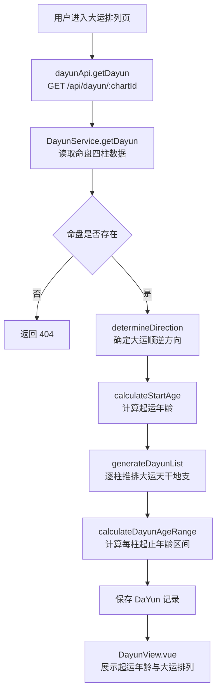
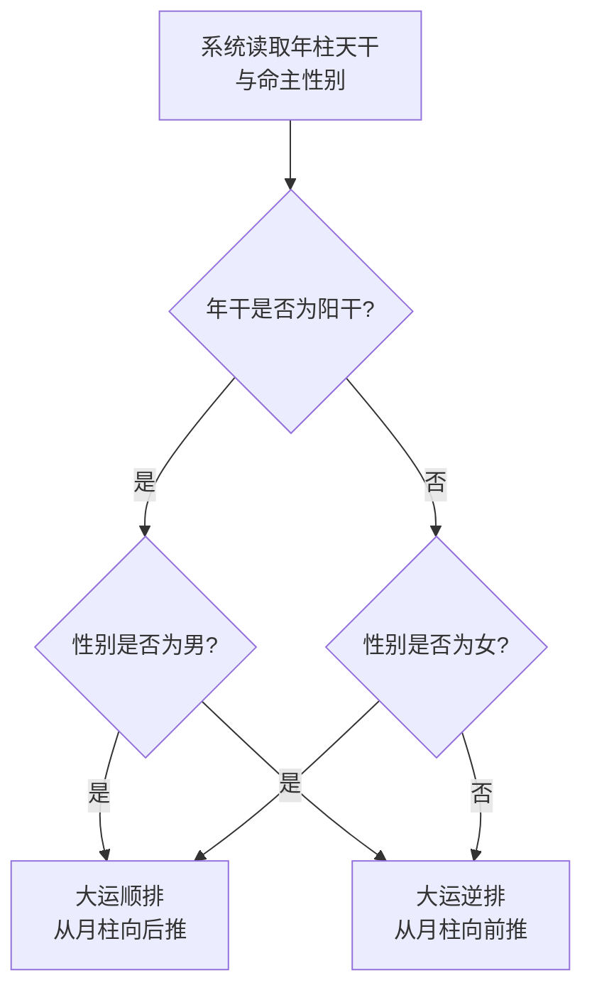
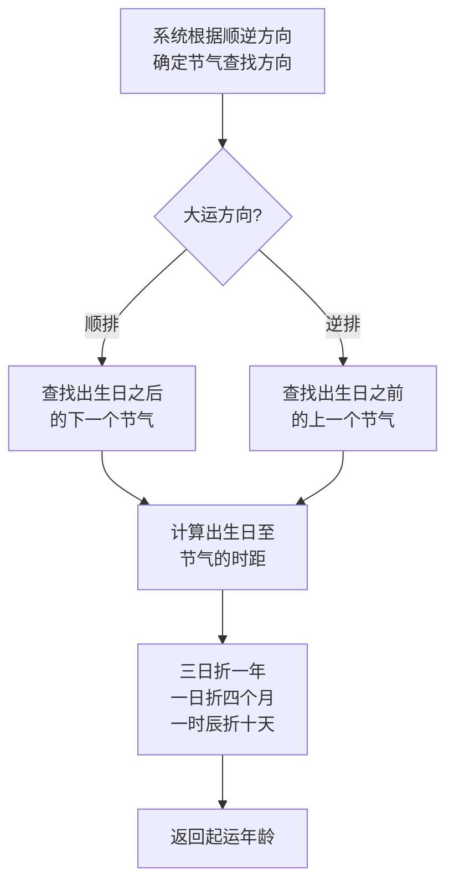
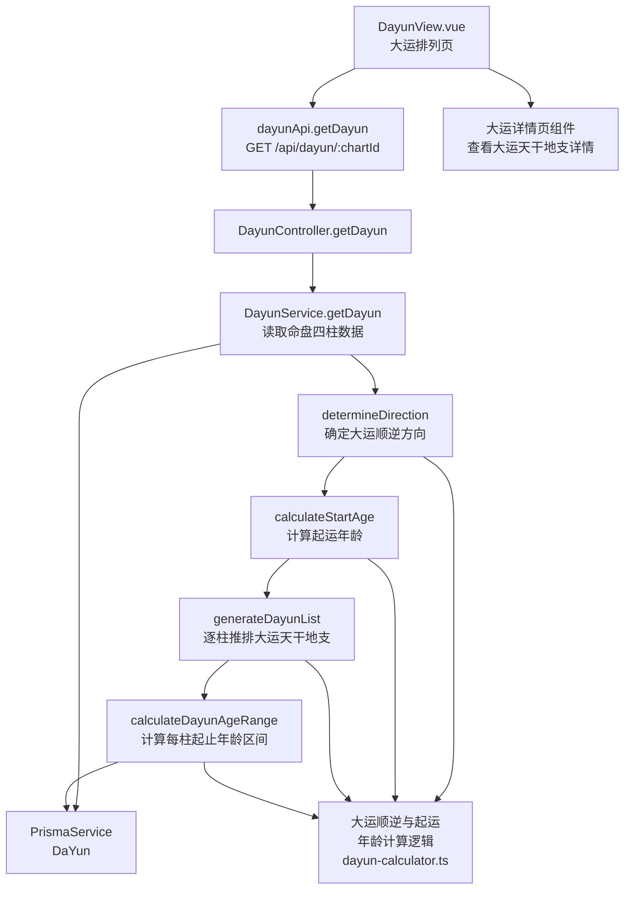

# 起运与大运排列

> PRD Reference: docs/PRD/06. 大运流年模块/01. 起运与大运排列/起运与大运排列.md#起运与大运排列

## 1. 业务流程

### 1.1 起运年龄计算与大运排列主流程

**触发**：用户在大运排列页（`/dayun`）查看命盘的大运排列信息。

**步骤**：

1. 用户进入大运排列页，前端从 `useDayunStore` 读取当前 `chartId`。
2. 前端调用 `dayunApi.getDayun()` 发送 `GET /api/dayun/:chartId` 请求。
3. 后端 `DayunController.getDayun()` 接收请求，`DayunService.getDayun()` 执行起运年龄计算与大运排列：
   - 调用 `determineDirection()` 根据性别与年干阴阳确定大运顺逆方向：阳年男命与阴年女命顺排，阴年男命与阳年女命逆排。
   - 调用 `calculateStartAge()` 根据出生日与最近节气的时距折算起运年龄：顺排取下一个节气时距，逆排取上一个节气时距，三日折一年、一日折四个月、一个时辰折十天。
   - 调用 `generateDayunList()` 从月柱起按顺逆方向逐柱推排大运天干地支。
   - 调用 `calculateDayunAgeRange()` 为每柱大运标注起止年龄区间，确保区间连续衔接。
4. 大运排列结果写入 `DaYun` 数据表。
5. 前端 `DayunView.vue` 展示起运年龄、大运顺逆方向与每柱大运详情。

**预期结果**：用户可查看命盘的起运年龄、大运顺逆方向与每柱大运天干地支及起止年龄区间。



### 1.2 大运顺逆方向判定流程

**触发**：系统在起运年龄计算之前，首先判定大运推排方向。

**步骤**：

1. 系统读取命盘的年柱天干与命主性别。
2. 判断年干阴阳：甲丙戊庚壬为阳干，乙丁己辛癸为阴干。
3. 阳年男命或阴年女命 → 大运顺排（从月柱向后推）。
4. 阴年男命或阳年女命 → 大运逆排（从月柱向前推）。
5. 返回大运顺逆方向结果。

**预期结果**：大运顺逆方向正确判定，阳年男命与阴年女命为顺排，阴年男命与阳年女命为逆排。



### 1.3 起运年龄计算流程

**触发**：大运顺逆方向确定后，系统计算起运年龄。

**步骤**：

1. 系统根据大运顺逆方向确定节气查找方向：
   - 顺排：查找出生日之后的下一个节气。
   - 逆排：查找出生日之前的上一个节气。
2. 调用 `calculateStartAge()` 计算出生日与最近节气的时距（天数与时辰数）。
3. 按照三日折一年、一日折四个月、一个时辰折十天的规则将时距折算为起运年龄。
4. 返回起运年龄结果。

**预期结果**：起运年龄准确折算，三日折一年、一日折四个月、一个时辰折十天。



## 2. 关键函数设计

### 2.1 DayunService.getDayun

```typescript
function getDayun(chartId: number): DaYunResult
```

- **职责**：根据命盘四柱数据计算起运年龄与大运排列，返回完整大运数据。
- **核心逻辑**：
  1. 通过 `chartId` 查询 `Chart` 与 `Pillar` 数据，验证命盘存在性。
  2. 调用 `determineDirection()` 判定大运顺逆方向。
  3. 调用 `calculateStartAge()` 计算起运年龄。
  4. 调用 `generateDayunList()` 逐柱推排大运天干地支。
  5. 调用 `calculateDayunAgeRange()` 计算每柱起止年龄区间。
  6. 保存 `DaYun` 记录至数据库。
  7. 返回大运排列结果。
- **PRD 追溯**：查看起运年龄、查看大运顺逆方向、查看每柱大运天干地支、查看每柱大运起止年龄区间 — FR-06

### 2.2 determineDirection

```typescript
function determineDirection(yearGan: string, gender: string): "顺排" | "逆排"
```

- **职责**：根据年干阴阳与性别判定大运推排方向。
- **核心逻辑**：
  1. 判断年干阴阳：甲丙戊庚壬为阳干，乙丁己辛癸为阴干。
  2. 阳年男命或阴年女命 → 返回 `"顺排"`。
  3. 阴年男命或阳年女命 → 返回 `"逆排"`。
- **PRD 追溯**：查看大运顺逆方向 — FR-06

### 2.3 calculateStartAge

```typescript
function calculateStartAge(birthDate: DateTime, direction: string, jieqiList: Jieqi[]): StartAgeResult
```

- **职责**：根据出生日与最近节气的时距折算起运年龄。
- **核心逻辑**：
  1. 根据大运方向确定节气查找方向：顺排取下一个节气，逆排取上一个节气。
  2. 计算出生日与最近节气的天数差与时辰差。
  3. 按照三日折一年、一日折四个月、一个时辰折十天折算为起运年龄。
  4. 返回起运年龄（整数年 + 余数月/天）。
- **PRD 追溯**：查看起运年龄 — FR-06

### 2.4 generateDayunList

```typescript
function generateDayunList(monthPillar: Pillar, direction: string, count: number): DayunItem[]
```

- **职责**：从月柱起按顺逆方向逐柱推排大运天干地支。
- **核心逻辑**：
  1. 取月柱天干地支为起点。
  2. 顺排时依次向后推排：甲→乙→丙→...，子→丑→寅→...。
  3. 逆排时依次向前推排：甲→癸→壬→...，子→亥→戌→...。
  4. 每柱大运管十年，天干地支各管五年。
  5. 按默认数量（8-10 柱）生成大运列表，每柱包含天干、地支、五行属性。
- **PRD 追溯**：查看每柱大运天干地支 — FR-06

### 2.5 calculateDayunAgeRange

```typescript
function calculateDayunAgeRange(startAge: number, dayunCount: number): AgeRange[]
```

- **职责**：为每柱大运标注起止年龄区间，确保区间连续衔接。
- **核心逻辑**：
  1. 起始年龄 = 起运年龄。
  2. 每柱大运管十年，起止区间连续衔接无间隔。
  3. 第 N 柱起止年龄 = [startAge + (N-1) * 10, startAge + N * 10 - 1]。
  4. 返回每柱大运的起止年龄区间列表。
- **PRD 追溯**：查看每柱大运起止年龄区间 — FR-06

## 3. 组件架构



## 4. 数据来源

- 大运顺逆与起运年龄计算逻辑：`code/backend/src/modules/dayun/lib/dayun-calculator.ts`
- 四柱天干地支数据：通过 `chartId` 引用模块 01 的 `Chart` 与 `Pillar` 表
- 节气数据：通过 `chartId` 引用模块 01 的 `CalendarService` 获取节气交接点
- 术语定义：`0.common/glossary.md`（大运、起运年龄、大运顺逆、流年等术语）