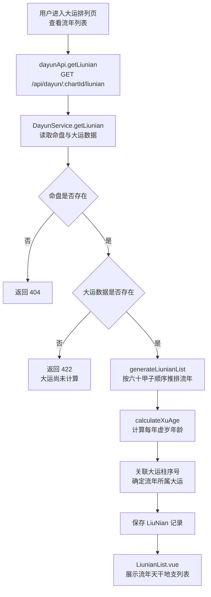
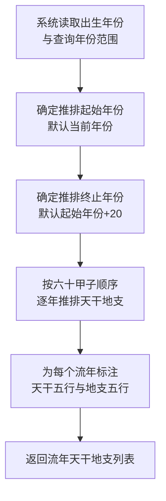
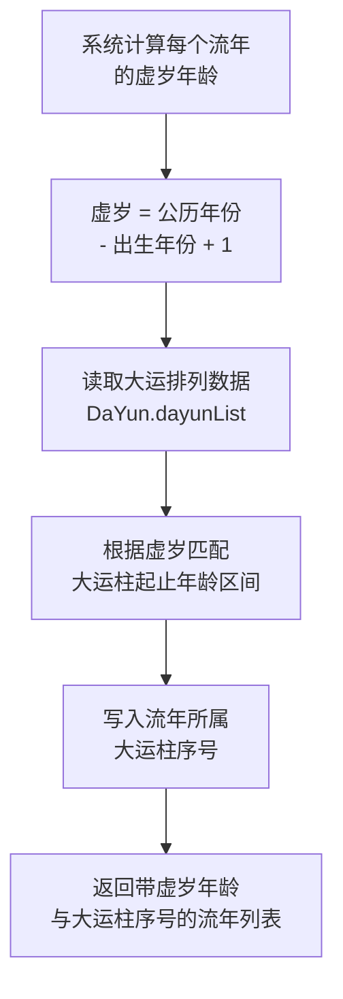
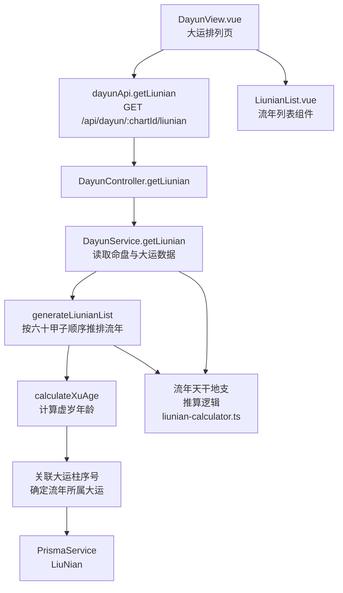

# 流年排列

> PRD Reference: docs/PRD/06. 大运流年模块/02. 流年排列/流年排列.md#流年排列

## 1. 业务流程

### 1.1 流年排列主流程

**触发**：用户在大运排列页（`/dayun`）查看流年天干地支列表。

**步骤**：

1. 用户进入大运排列页，前端从 `useDayunStore` 读取当前 `chartId`。
2. 前端调用 `dayunApi.getLiunian()` 发送 `GET /api/dayun/:chartId/liunian` 请求（可传 `startYear` 与 `endYear` 查询参数）。
3. 后端 `DayunController.getLiunian()` 接收请求，`DayunService.getLiunian()` 执行流年排列计算：
   - 调用 `generateLiunianList()` 根据出生年份与查询年份范围，按六十甲子顺序推排每年流年天干地支。
   - 调用 `calculateXuAge()` 计算每个流年的虚岁年龄（公历年份 - 出生年份 + 1）。
   - 关联每个流年到其所属大运柱序号。
4. 流年排列结果写入 `LiuNian` 数据表。
5. 前端 `LiunianList.vue` 展示流年天干地支列表。

**预期结果**：用户可查看当年及未来若干年的流年天干地支列表，包含公历年份、虚岁年龄与所属大运。



### 1.2 流年天干地支推排流程

**触发**：系统根据出生年份与当前年份确定流年推排范围后，逐柱推排流年天干地支。

**步骤**：

1. 系统读取命盘出生年份（从 Chart 数据获取）。
2. 确定推排起始年份：默认为当前年份。
3. 确定推排终止年份：默认为起始年份 + 20 年（可通过查询参数调整）。
4. 调用 `generateLiunianList()` 按六十甲子顺序逐年推排：
   - 从出生年份的干支起，依次推排每年天干地支。
   - 天干按甲→乙→丙→丁→戊→己→庚→辛→壬→癸顺序循环。
   - 地支按子→丑→寅→卯→辰→巳→午→未→申→酉→戌→亥顺序循环。
5. 为每个流年标注五行属性（天干五行、地支五行）。
6. 返回流年天干地支列表。

**预期结果**：流年天干地支按六十甲子顺序正确推排，每年与公历年份一一对应。



### 1.3 虚岁计算与所属大运关联流程

**触发**：流年天干地支推排完成后，系统计算虚岁年龄并关联所属大运柱。

**步骤**：

1. 调用 `calculateXuAge()` 对每个流年计算虚岁年龄：虚岁 = 公历年份 - 出生年份 + 1。
2. 读取大运排列数据（`DaYun.dayunList`）。
3. 对每个流年，根据其虚岁年龄匹配大运柱序号：虚岁年龄落在大运柱的 `[startAge, endAge]` 区间内即属于该大运柱。
4. 将 `dayunIndex` 字段写入每个流年记录。
5. 返回带虚岁年龄与大运柱序号的流年列表。

**预期结果**：每个流年均标注了虚岁年龄与所属大运柱序号。



## 2. 关键函数设计

### 2.1 DayunService.getLiunian

```typescript
function getLiunian(chartId: number, startYear?: number, endYear?: number): LiunianResult
```

- **职责**：根据命盘出生年份与查询年份范围计算流年排列，返回流年天干地支列表。
- **核心逻辑**：
  1. 通过 `chartId` 查询 `Chart` 数据，验证命盘存在性。
  2. 查询 `DaYun` 数据，验证大运已计算。
  3. 调用 `generateLiunianList()` 生成流年天干地支列表。
  4. 调用 `calculateXuAge()` 计算虚岁年龄。
  5. 关联每个流年到其所属大运柱。
  6. 保存 `LiuNian` 记录至数据库。
  7. 返回流年排列结果。
- **PRD 追溯**：查看当年流年天干地支、查看未来若干年流年天干地支列表、按年份范围筛选流年天干地支 — FR-06

### 2.2 generateLiunianList

```typescript
function generateLiunianList(birthYear: number, startYear: number, endYear: number): LiunianItem[]
```

- **职责**：按六十甲子顺序从出生年份起逐年推排流年天干地支。
- **核心逻辑**：
  1. 根据出生年份确定出生年的天干地支（六十甲子循环）。
  2. 从出生年份起按顺序推排天干（甲→乙→...→癸→甲循环）与地支（子→丑→...→亥→子循环）。
  3. 在查询年份范围 `[startYear, endYear]` 内截取。
  4. 为每个流年标注天干五行与地支五行属性。
  5. 返回流年天干地支列表。
- **PRD 追溯**：查看流年天干地支列表、查看流年天干地支的五行属性 — FR-06

### 2.3 calculateXuAge

```typescript
function calculateXuAge(birthYear: number, currentYear: number): number
```

- **职责**：计算流年的虚岁年龄。
- **核心逻辑**：
  1. 虚岁年龄 = 当前公历年份 - 出生公历年份 + 1。
  2. 返回虚岁年龄。
- **PRD 追溯**：查看流年虚岁年龄 — FR-06

## 3. 组件架构



## 4. 数据来源

- 流年天干地支推算逻辑：`code/backend/src/modules/dayun/lib/liunian-calculator.ts`
- 四柱天干地支数据与出生年份：通过 `chartId` 引用模块 01 的 `Chart` 与 `Pillar` 表
- 大运排列数据：通过 `chartId` 引用本模块的 `DaYun` 表（流年需关联所属大运柱）
- 术语定义：`0.common/glossary.md`（流年、虚岁、六十甲子等术语）