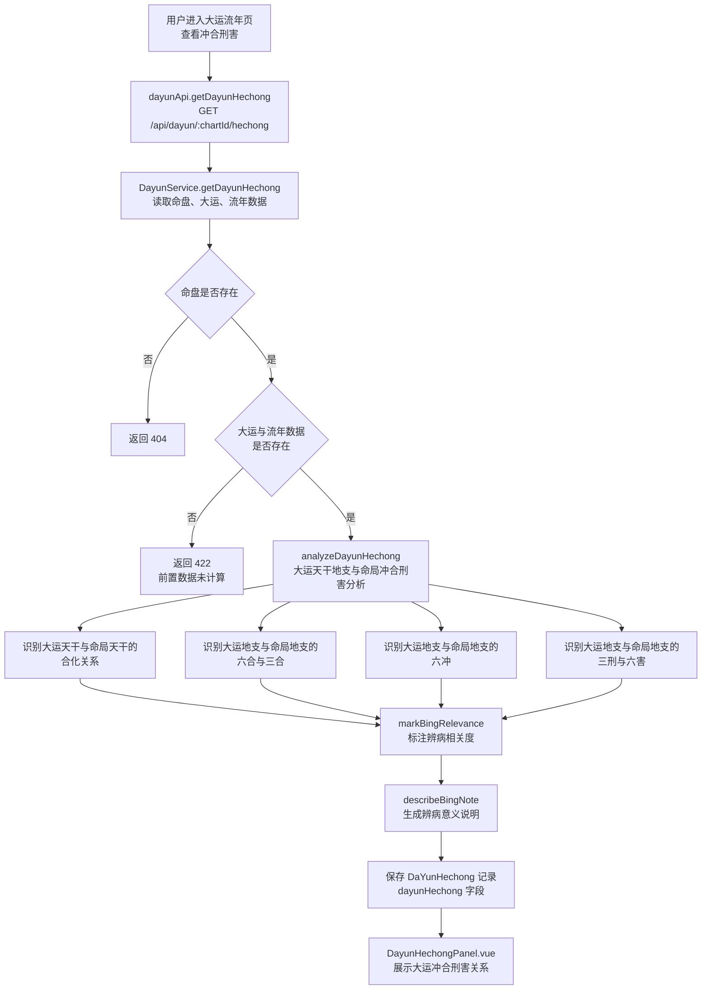
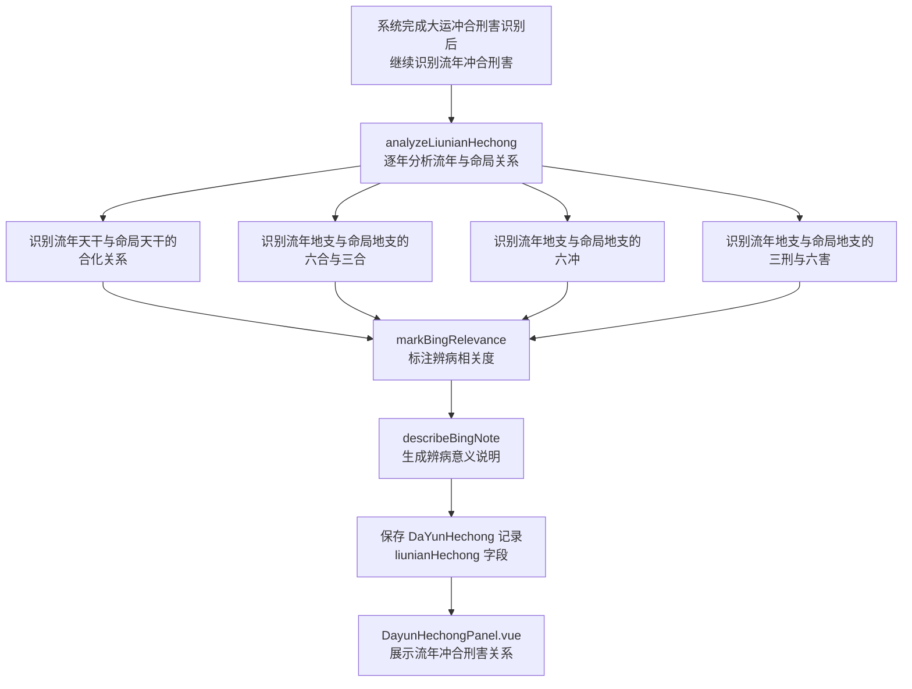
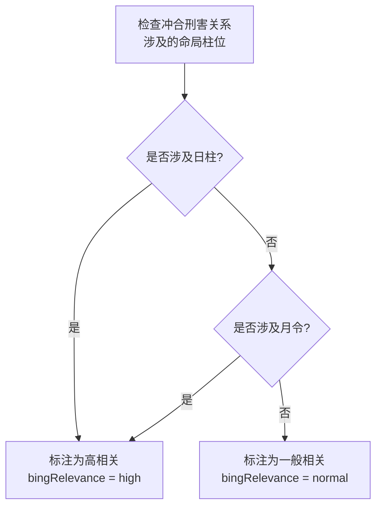
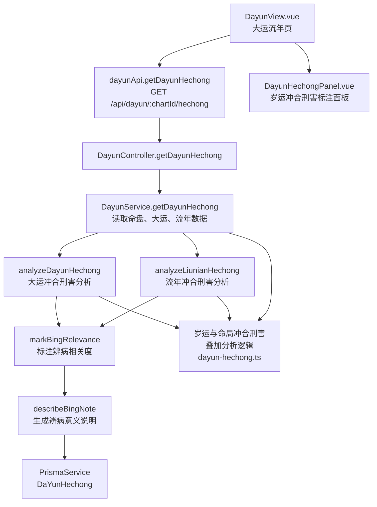

# 岁运冲合刑害

> PRD Reference: docs/PRD/06. 大运流年模块/03. 岁运冲合刑害/岁运冲合刑害.md#岁运冲合刑害

## 1. 业务流程

### 1.1 大运冲合刑害识别流程

**触发**：用户在岁运冲合刑害总览页（`/dayun`）查看大运与命局的冲合刑害关系。

**步骤**：

1. 用户进入大运流年页，前端从 `useDayunStore` 读取当前 `chartId`。
2. 前端调用 `dayunApi.getDayunHechong()` 发送 `GET /api/dayun/:chartId/hechong` 请求。
3. 后端 `DayunController.getDayunHechong()` 接收请求，`DayunService.getDayunHechong()` 执行岁运冲合刑害分析：
   - 调用 `analyzeDayunHechong()` 对每柱大运天干地支与命局四柱天干地支逐一比对：
     - 识别大运天干与命局天干的合化关系（天干五合）。
     - 识别大运地支与命局地支的六合与三合关系。
     - 识别大运地支与命局地支的六冲关系。
     - 识别大运地支与命局地支的三刑与六害关系。
   - 调用 `markBingRelevance()` 标注每组冲合刑害关系的辨病相关度：
     - 涉及日柱的冲合刑害标注为高相关（`"high"`）。
     - 涉及月令的冲合刑害标注为高相关（`"high"`）。
     - 涉及年柱或时柱的冲合刑害标注为一般相关（`"normal"`）。
   - 调用 `describeBingNote()` 为每组关系生成辨病意义说明。
4. 大运冲合刑害标注结果写入 `DaYunHechong` 数据表的 `dayunHechong` 字段。
5. 前端 `DayunHechongPanel.vue` 展示大运冲合刑害关系及辨病相关度标注。

**预期结果**：用户可查看每柱大运与命局的冲合刑害关系列表，包含天干合化、地支六合三合、六冲三刑六害及辨病相关度标注。



### 1.2 流年冲合刑害识别流程

**触发**：系统完成大运冲合刑害识别后，继续识别每个流年与命局的冲合刑害关系。

**步骤**：

1. 系统对每个流年天干地支与命局四柱天干地支逐一比对：
   - 识别流年天干与命局天干的合化关系（天干五合）。
   - 识别流年地支与命局地支的六合与三合关系。
   - 识别流年地支与命局地支的六冲关系。
   - 识别流年地支与命局地支的三刑与六害关系。
2. 调用 `markBingRelevance()` 标注每组关系的辨病相关度（与大运相同的判定规则）。
3. 调用 `describeBingNote()` 为每组关系生成辨病意义说明。
4. 流年冲合刑害标注结果写入 `DaYunHechong` 数据表的 `liunianHechong` 字段。
5. 前端 `DayunHechongPanel.vue` 展示流年冲合刑害关系及辨病相关度标注。

**预期结果**：用户可查看每个流年与命局的冲合刑害关系列表，包含天干合化、地支六合三合、六冲三刑六害及辨病相关度标注。



### 1.3 辨病相关度判定规则

**触发**：系统在识别冲合刑害关系后，对每组关系标注辨病相关度。

**步骤**：

1. 检查每组冲合刑害关系涉及的命局柱位。
2. 涉及日柱（日干或日支）的冲合刑害 → 标注为高相关（`"high"`），原因：日柱为命局核心，冲合刑害对命局影响最大。
3. 涉及月令（月支）的冲合刑害 → 标注为高相关（`"high"`），原因：月令决定五行旺衰，冲合刑害可能改变命局格局。
4. 仅涉及年柱或时柱的冲合刑害 → 标注为一般相关（`"normal"`），原因：年柱时柱对命局核心影响相对次要。
5. 将辨病相关度标注写入每条冲合刑害关系的 `bingRelevance` 字段。

**预期结果**：每组冲合刑害关系均标注了辨病相关度与辨病意义说明。



## 2. 关键函数设计

### 2.1 DayunService.getDayunHechong

```typescript
function getDayunHechong(chartId: number): DaYunHechongResult
```

- **职责**：计算大运与流年对命局的冲合刑害关系，返回全量岁运冲合刑害标注数据。
- **核心逻辑**：
  1. 通过 `chartId` 查询 `Chart`、`Pillar`、`DaYun`、`LiuNian` 数据，验证命盘与岁运数据存在性。
  2. 调用 `analyzeDayunHechong()` 对每柱大运与命局进行冲合刑害分析。
  3. 调用 `analyzeLiunianHechong()` 对每个流年与命局进行冲合刑害分析。
  4. 调用 `markBingRelevance()` 标注辨病相关度。
  5. 调用 `describeBingNote()` 生成辨病意义说明。
  6. 保存 `DaYunHechong` 记录至数据库。
  7. 返回岁运冲合刑害结果。
- **PRD 追溯**：查看大运与命局的冲合刑害关系列表、查看流年与命局的冲合刑害关系列表、查看冲合刑害关系的辨病相关度标注 — FR-06

### 2.2 analyzeDayunHechong

```typescript
function analyzeDayunHechong(dayunList: DayunItem[], pillars: Pillar[], hechongRules: HechongRules): DayunHechongItem[]
```

- **职责**：对每柱大运天干地支与命局四柱天干地支进行冲合刑害分析。
- **核心逻辑**：
  1. 遍历每柱大运天干地支。
  2. 大运天干与命局四柱天干逐一比对，调用合冲刑害规则识别天干五合关系。
  3. 大运地支与命局四柱地支逐一比对，识别六合、三合、六冲、三刑、六害、自刑关系。
  4. 对每组识别出的关系记录大运干支、命局干支、柱位、关系类型。
  5. 返回大运冲合刑害标注列表。
- **PRD 追溯**：查看大运与命局的冲合刑害关系列表、查看每组冲合刑害涉及的命局柱位 — FR-06

### 2.3 analyzeLiunianHechong

```typescript
function analyzeLiunianHechong(liunianList: LiunianItem[], pillars: Pillar[], hechongRules: HechongRules): LiunianHechongItem[]
```

- **职责**：对每个流年天干地支与命局四柱天干地支进行冲合刑害分析。
- **核心逻辑**：
  1. 遍历每个流年天干地支。
  2. 流年天干与命局四柱天干逐一比对，识别天干五合关系。
  3. 流年地支与命局四柱地支逐一比对，识别六合、三合、六冲、三刑、六害、自刑关系。
  4. 对每组识别出的关系记录流年干支、命局干支、柱位、关系类型。
  5. 返回流年冲合刑害标注列表。
- **PRD 追溯**：查看流年与命局的冲合刑害关系列表、查看每组冲合刑害涉及的命局柱位 — FR-06

### 2.4 markBingRelevance

```typescript
function markBingRelevance(hechongItems: HechongItem[], pillars: Pillar[]): void
```

- **职责**：对每组冲合刑害关系标注辨病相关度。
- **核心逻辑**：
  1. 遍历每组冲合刑害关系。
  2. 涉及日柱（日干或日支）→ 标注 `bingRelevance = "high"`，`bingNote` 说明日柱为核心。
  3. 涉及月令（月支）→ 标注 `bingRelevance = "high"`，`bingNote` 说明月令决定五行旺衰。
  4. 仅涉及年柱或时柱 → 标注 `bingRelevance = "normal"`，`bingNote` 说明影响相对次要。
- **PRD 追溯**：查看冲合刑害关系的辨病相关度标注、查看冲合刑害类型的辨病意义说明 — FR-06

### 2.5 describeBingNote

```typescript
function describeBingNote(hechongItem: HechongItem): string
```

- **职责**：为每组冲合刑害关系生成辨病意义说明文本。
- **核心逻辑**：
  1. 冲可能破格或破合 → 生成"冲可能破格"或"冲可能破合"的说明。
  2. 合可能绊住柱位或化五行 → 生成"合可能绊住用神"或"合可能化五行"的说明。
  3. 刑可能伤及喜神 → 生成"刑可能伤及喜神"的说明。
  4. 害可能暗损 → 生成"害可能暗损"的说明。
  5. 结合辨病相关度生成完整说明文本。
- **PRD 追溯**：查看冲合刑害类型的辨病意义说明 — FR-06

## 3. 组件架构



## 4. 数据来源

- 岁运与命局冲合刑害叠加分析逻辑：`code/backend/src/modules/dayun/lib/dayun-hechong.ts`
- 合冲刑害识别规则：复用模块 03 的合冲刑害规则库（天干五合、地支六合三合、六冲三刑六害自刑）
- 命盘四柱数据：通过 `chartId` 引用模块 01 的 `Chart` 与 `Pillar` 表
- 大运排列数据：通过 `chartId` 引用本模块的 `DaYun` 表
- 流年排列数据：通过 `chartId` 引用本模块的 `LiuNian` 表
- 术语定义：`0.common/glossary.md`（合冲刑害、辨病相关度、大运、流年等术语）