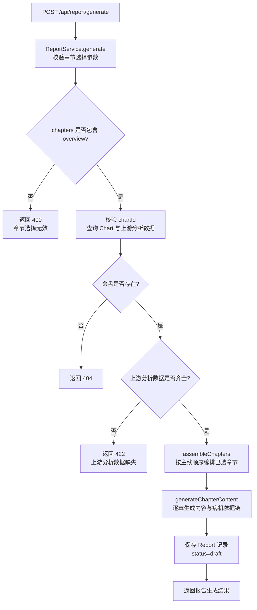
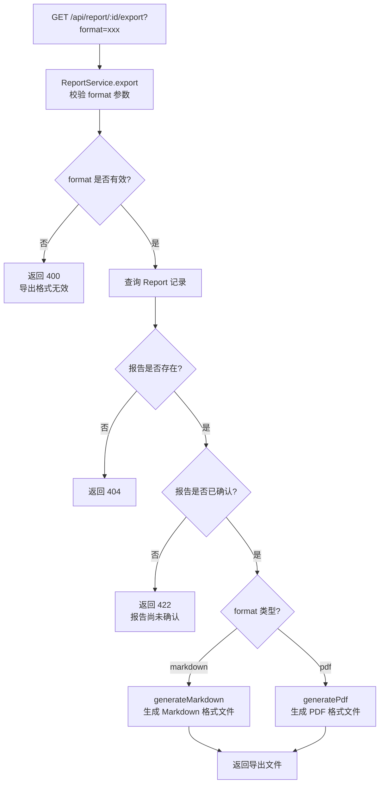
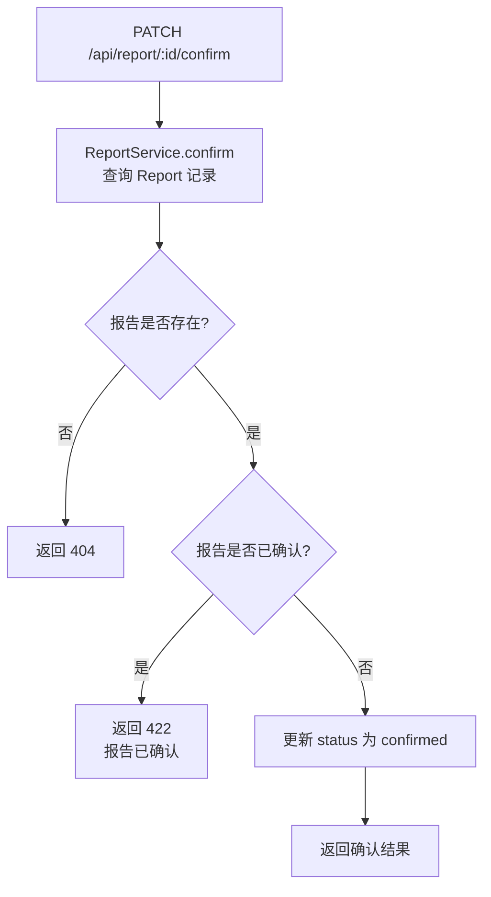
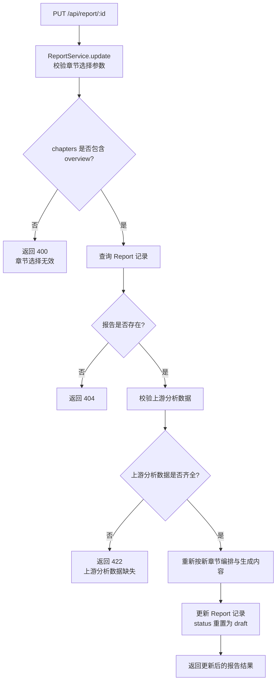

# API 设计 — 07. 论断报告模块

## 概述

本模块提供两组 REST API，支撑报告章节组织与报告导出两个子模块的前后端交互。根据 `code-structure.md §4` 与 `§5.8`，本模块的两个端点分别为报告生成与报告导出。所有端点遵循 `code-structure.md §4` 的路径与处理器约定，错误响应遵循 ADR-003（RFC7807 `application/problem+json`）。

## 1. 子模块 API 汇总

### 1.1 报告章节组织

| 方法 | 路径 | PRD 业务功能 | 说明 |
|------|------|-------------|------|
| POST | `/api/report/generate` | 展示八大章节列表、用户勾选章节、系统按主线编排章节、生成各章节内容、逐章预览报告内容、每条论断展示病机依据链、返回修改章节选择、确认报告内容 | 根据命盘 ID 与章节选择生成论断报告，返回汇编后的完整报告内容 |

### 1.2 报告导出

| 方法 | 路径 | PRD 业务功能 | 说明 |
|------|------|-------------|------|
| GET | `/api/report/:id/export` | 选择导出格式、系统生成格式文件、下载导出文件 | 将已确认的报告导出为 Markdown 或 PDF 格式文件 |

## 2. 端点详情

### 2.1 POST /api/report/generate

**处理器**：`ReportController.generate()`
**服务**：`ReportService`
**PRD 追溯**：展示八大章节列表、用户勾选章节、系统按主线编排章节、生成各章节内容、逐章预览报告内容、每条论断展示病机依据链、返回修改章节选择、确认报告内容

#### 请求

| 字段 | 类型 | 必填 | 约束 | 示例 |
|------|------|------|------|------|
| chartId | Int | 是 | 有效命盘 ID | `1` |
| chapters | Array\<String\> | 是 | 章节选择列表，至少包含 `"overview"`；有效值：`overview` / `diagnosis` / `yongshen` / `judgment` / `dayun_yaoxiao` / `shensha` / `hechong` / `conclusion` | `["overview", "diagnosis", "yongshen", "judgment"]` |

#### 响应（200 OK）

| 字段 | 类型 | 说明 | 示例 |
|------|------|------|------|
| id | Int | 报告记录 ID | `1` |
| chartId | Int | 命盘 ID | `1` |
| chapterSelection | Object | 章节选择配置 | 见 `00.database-design.md` 中 chapterSelection JSON 结构定义 |
| reportContent | Object | 汇编后的报告内容 | 见 `00.database-design.md` 中 reportContent JSON 结构定义 |
| status | String | 报告状态 | `"draft"` |
| createdAt | String (ISO 8601) | 创建时间 | `"2024-01-01T00:00:00Z"` |

#### 错误响应

| HTTP 状态码 | 错误类型 | 说明 |
|------------|---------|------|
| 400 | `https://bazi.app/errors/invalid-chapters` | 章节选择参数无效（不含 overview、包含无效章节 key） |
| 404 | `https://bazi.app/errors/chart-not-found` | 命盘 ID 不存在 |
| 422 | `https://bazi.app/errors/chart-analysis-required` | 上游分析数据尚未完成（需先调用各分析模块接口） |
| 500 | `https://bazi.app/errors/report-generation-failed` | 报告生成内部错误 |

#### 流程图



### 2.2 GET /api/report/:id/export

**处理器**：`ReportController.export()`
**服务**：`ReportService`
**PRD 追溯**：选择导出格式、系统生成格式文件、下载导出文件

#### 请求

| 字段 | 类型 | 必填 | 约束 | 示例 |
|------|------|------|------|------|
| id | Int | 是 | 路径参数，有效报告 ID | `1` |
| format | String | 是 | 查询参数，导出格式：`markdown` / `pdf` | `"pdf"` |

#### 响应（200 OK）

- `format=markdown`：返回 `text/markdown` 内容，文件名 `report-{id}.md`
- `format=pdf`：返回 `application/pdf` 二进制流，文件名 `report-{id}.pdf`

**Markdown 响应头**：

```
Content-Type: text/markdown; charset=utf-8
Content-Disposition: attachment; filename="report-1.md"
```

**PDF 响应头**：

```
Content-Type: application/pdf
Content-Disposition: attachment; filename="report-1.pdf"
```

#### 错误响应

| HTTP 状态码 | 错误类型 | 说明 |
|------------|---------|------|
| 400 | `https://bazi.app/errors/invalid-format` | 导出格式参数无效（仅支持 markdown / pdf） |
| 404 | `https://bazi.app/errors/report-not-found` | 报告 ID 不存在 |
| 422 | `https://bazi.app/errors/report-not-confirmed` | 报告尚未确认（status 不为 confirmed） |
| 500 | `https://bazi.app/errors/export-failed` | 导出生成内部错误 |

#### 流程图



### 2.3 PATCH /api/report/:id/confirm

**处理器**：`ReportController.confirm()`
**服务**：`ReportService`
**PRD 追溯**：确认报告内容

> 说明：此端点用于用户确认报告内容（将 status 从 draft 变更为 confirmed），确认后方可进行导出操作。PRD 业务流程中"确认报告内容"步骤需要此端点支撑。

#### 请求

| 字段 | 类型 | 必填 | 约束 | 示例 |
|------|------|------|------|------|
| id | Int | 是 | 路径参数，有效报告 ID | `1` |

#### 响应（200 OK）

| 字段 | 类型 | 说明 | 示例 |
|------|------|------|------|
| id | Int | 报告记录 ID | `1` |
| chartId | Int | 命盘 ID | `1` |
| status | String | 报告状态 | `"confirmed"` |
| updatedAt | String (ISO 8601) | 更新时间 | `"2024-01-01T00:00:00Z"` |

#### 错误响应

| HTTP 状态码 | 错误类型 | 说明 |
|------------|---------|------|
| 404 | `https://bazi.app/errors/report-not-found` | 报告 ID 不存在 |
| 422 | `https://bazi.app/errors/report-already-confirmed` | 报告已确认，无需重复操作 |

#### 流程图



### 2.4 PUT /api/report/:id

**处理器**：`ReportController.update()`
**服务**：`ReportService`
**PRD 追溯**：返回修改章节选择

> 说明：此端点用于用户调整章节选择后重新生成报告内容（对应 PRD 业务流程中"用户是否调整章节选择→是"分支）。

#### 请求

| 字段 | 类型 | 必填 | 约束 | 示例 |
|------|------|------|------|------|
| id | Int | 是 | 路径参数，有效报告 ID | `1` |
| chapters | Array\<String\> | 是 | 章节选择列表，至少包含 `"overview"`；有效值同 POST /api/report/generate | `["overview", "diagnosis", "conclusion"]` |

#### 响应（200 OK）

| 字段 | 类型 | 说明 | 示例 |
|------|------|------|------|
| id | Int | 报告记录 ID | `1` |
| chartId | Int | 命盘 ID | `1` |
| chapterSelection | Object | 更新后的章节选择配置 | 见 `00.database-design.md` 中 chapterSelection JSON 结构定义 |
| reportContent | Object | 重新汇编后的报告内容 | 见 `00.database-design.md` 中 reportContent JSON 结构定义 |
| status | String | 报告状态（重置为 draft） | `"draft"` |
| createdAt | String (ISO 8601) | 创建时间 | `"2024-01-01T00:00:00Z"` |
| updatedAt | String (ISO 8601) | 更新时间 | `"2024-01-01T01:00:00Z"` |

#### 错误响应

| HTTP 状态码 | 错误类型 | 说明 |
|------------|---------|------|
| 400 | `https://bazi.app/errors/invalid-chapters` | 章节选择参数无效 |
| 404 | `https://bazi.app/errors/report-not-found` | 报告 ID 不存在 |
| 422 | `https://bazi.app/errors/chart-analysis-required` | 上游分析数据尚未完成 |
| 500 | `https://bazi.app/errors/report-generation-failed` | 报告重新生成内部错误 |

#### 流程图



## 3. 数据模型映射

| 端点 | 读取表 | 写入表 | 说明 |
|------|--------|--------|------|
| `POST /api/report/generate` | Chart, Pillar, WuxingStat, DayMasterStrength, ShishenLabel, GejuPattern, HechongRelation, BingMachine, YongShenJiXi, JiXiongVerdict, ShenshaLabel, DaYun, LiuNian, DaYunHechong | Report | 读取排盘及各上游分析数据，汇编生成报告内容 |
| `GET /api/report/:id/export` | Report | — | 读取已确认报告内容，转换为 Markdown/PDF 格式 |
| `PATCH /api/report/:id/confirm` | Report | Report | 更新报告状态为 confirmed |
| `PUT /api/report/:id` | Chart, Pillar, WuxingStat, DayMasterStrength, ShishenLabel, GejuPattern, HechongRelation, BingMachine, YongShenJiXi, JiXiongVerdict, ShenshaLabel, DaYun, LiuNian, DaYunHechong | Report | 重新读取上游数据，重新汇编生成报告内容 |

## 4. 错误处理总则

所有错误响应遵循 ADR-003（RFC7807 `application/problem+json`）：

```json
{
  "type": "https://bazi.app/errors/report-not-found",
  "title": "报告不存在",
  "status": 404,
  "detail": "id=999 对应的报告记录不存在"
}
```

| HTTP 状态码 | 适用场景 |
|------------|---------|
| 400 | 请求参数无效（章节选择不含 overview、导出格式不支持） |
| 404 | 命盘 ID 或报告 ID 不存在 |
| 422 | 前置依赖数据尚未完成或报告状态不允许操作 |
| 500 | 报告生成或导出内部错误 |

## 5. 跨模块依赖

| 依赖方向 | 说明 |
|----------|------|
| 本模块 → 模块 01（八字排盘与历法） | 通过 `chartId` 引用 Chart + Pillar 数据，作为"基本命盘概览"章节内容来源 |
| 本模块 → 模块 02（五行与十神） | 通过 `chartId` 引用 WuxingStat、DayMasterStrength、ShishenLabel、GejuPattern 数据，辅助"基本命盘概览""命局诊断""用药方略"章节 |
| 本模块 → 模块 03（合冲刑害） | 通过 `chartId` 引用 HechongRelation 数据，作为"合冲刑害详解"章节内容来源 |
| 本模块 → 模块 04（辨病与用神） | 通过 `chartId` 引用 BingMachine、YongShenJiXi、JiXiongVerdict 数据，作为"命局诊断""用药方略""分维论断"章节内容来源 |
| 本模块 → 模块 05（神煞标注） | 通过 `chartId` 引用 ShenshaLabel 数据，作为"神煞与特殊格局"章节内容来源 |
| 本模块 → 模块 06（大运流年） | 通过 `chartId` 引用 DaYun、LiuNian、DaYunHechong 数据，作为"岁运药效"章节内容来源 |