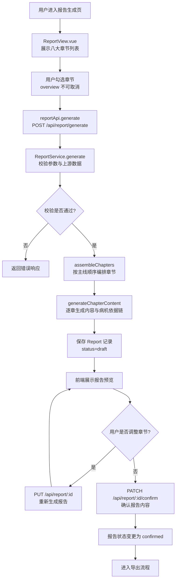
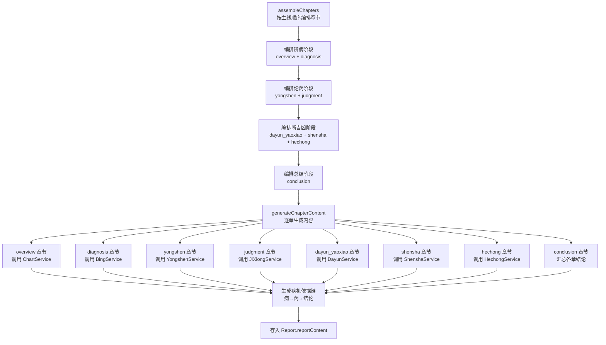
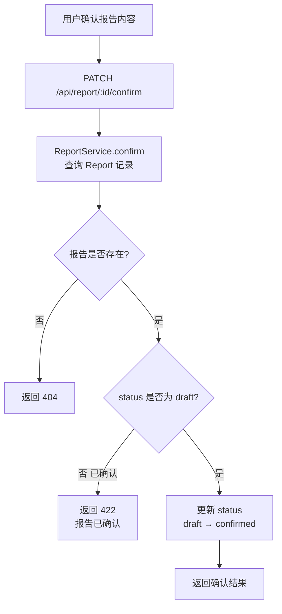
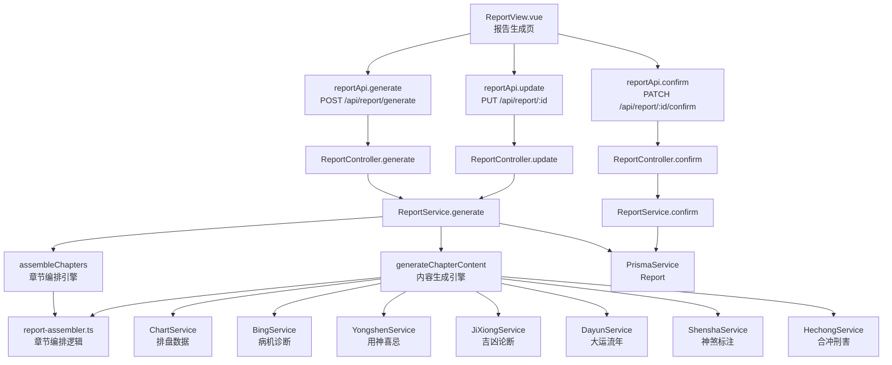

# 报告章节组织

> PRD Reference: docs/PRD/07. 论断报告模块/01. 报告章节组织/报告章节组织.md#报告章节组织

## 1. 业务流程

### 1.1 报告章节选择与生成主流程

**触发**：用户在报告生成页（`/report`）选择章节并生成论断报告。

**步骤**：

1. 用户进入报告生成页，前端 `ReportView.vue` 展示八大章节列表及各章节简介。
2. 前端默认勾选"基本命盘概览"章节（不可取消），用户可勾选其他章节。
3. 前端调用 `reportApi.generate()` 发送 `POST /api/report/generate` 请求，传入 `chartId` 与 `chapters` 选择列表。
4. 后端 `ReportController.generate()` 接收请求，`ReportService.generate()` 执行报告生成：
   - 校验章节选择参数：`chapters` 必须包含 `"overview"`，所有 key 必须在有效范围内。
   - 校验 `chartId` 对应的命盘存在性。
   - 校验上游分析数据是否齐全（根据所选章节，检查对应模块的分析结果是否存在）。
   - 调用 `assembleChapters()` 按"辨病→论药→断吉凶"主线顺序编排已选章节。
   - 调用 `generateChapterContent()` 逐章生成内容与病机依据链。
5. 报告记录写入 `Report` 数据表，`status` 为 `"draft"`。
6. 前端展示报告预览内容，每条论断附带病机依据链（病→药→结论）。
7. 用户可逐章查看报告内容，或返回修改章节选择（调用 `PUT /api/report/:id` 重新生成）。
8. 用户确认报告内容后，调用 `PATCH /api/report/:id/confirm` 将状态变更为 `"confirmed"`。

**预期结果**：用户可选择章节生成论断报告，报告按"辨病→论药→断吉凶"主线编排，每条论断附带病机依据链。



### 1.2 章节编排与内容生成流程

**触发**：`ReportService.generate()` 校验通过后，系统按主线顺序编排章节并生成内容。

**步骤**：

1. `assembleChapters()` 接收用户选择的章节列表，按主线顺序（辨病→论药→断吉凶）重新排列：
   - 辨病阶段：`overview`（基本命盘概览）→ `diagnosis`（命局诊断）
   - 论药阶段：`yongshen`（用药方略）→ `judgment`（分维论断）
   - 断吉凶阶段：`dayun_yaoxiao`（岁运药效）→ `shensha`（神煞与特殊格局）→ `hechong`（合冲刑害详解）
   - 总结阶段：`conclusion`（综合论断与建议）
2. `generateChapterContent()` 根据各章节的数据来源模块，逐章调用对应服务获取分析数据：
   - `overview`：调用 `ChartService` 获取排盘数据。
   - `diagnosis`：调用 `BingService` 获取病机诊断数据。
   - `yongshen`：调用 `YongshenService` 获取用神喜忌数据。
   - `judgment`：调用 `JiXiongService` 获取吉凶论断数据。
   - `dayun_yaoxiao`：调用 `DayunService` 获取大运流年数据。
   - `shensha`：调用 `ShenshaService` 获取神煞标注数据。
   - `hechong`：调用 `HechongService` 获取合冲刑害数据。
   - `conclusion`：汇总以上各章结论生成综合论断。
3. 每条论断必须关联病机依据链（病→药→结论），`generateChapterContent()` 在生成内容时自动从病机数据中提取依据链。
4. 各章节内容按主线顺序存入 `Report.reportContent` JSON 字段。

**预期结果**：章节按"辨病→论药→断吉凶"主线顺序编排，每条论断附带病机依据链，前后章节有逻辑衔接。



### 1.3 报告确认流程

**触发**：用户在预览页确认报告内容。

**步骤**：

1. 用户确认报告内容后，前端调用 `PATCH /api/report/:id/confirm`。
2. 后端 `ReportService.confirm()` 将 `Report.status` 从 `"draft"` 变更为 `"confirmed"`。
3. 确认后报告内容不可再编辑，进入导出就绪状态。

**预期结果**：报告状态变更为 `"confirmed"`，可进行导出操作。



## 2. 关键函数设计

### 2.1 ReportService.generate

```typescript
function generate(chartId: number, chapters: string[]): ReportResult
```

- **职责**：根据命盘 ID 与章节选择生成论断报告，返回汇编后的完整报告内容。
- **核心逻辑**：
  1. 校验 `chapters` 参数：必须包含 `"overview"`，所有 key 必须在有效范围内。
  2. 通过 `chartId` 查询 `Chart` 数据，验证命盘存在性。
  3. 根据所选章节，校验对应上游模块分析数据是否齐全。
  4. 调用 `assembleChapters()` 按主线顺序编排已选章节。
  5. 调用 `generateChapterContent()` 逐章生成内容与病机依据链。
  6. 保存 `Report` 记录至数据库，`status` 为 `"draft"`。
  7. 返回报告生成结果。
- **PRD 追溯**：展示八大章节列表、用户勾选章节、系统按主线编排章节、生成各章节内容 — FR-08

### 2.2 assembleChapters

```typescript
function assembleChapters(chapters: string[]): ChapterOrderResult
```

- **职责**：将用户选择的章节按"辨病→论药→断吉凶"主线顺序重新排列。
- **核心逻辑**：
  1. 定义主线章节顺序：`overview` → `diagnosis` → `yongshen` → `judgment` → `dayun_yaoxiao` → `shensha` → `hechong` → `conclusion`。
  2. 从主线顺序中筛选出用户已选择的章节。
  3. 返回排序后的章节列表（保证 `overview` 始终在首位）。
  4. 确保前后章节有逻辑衔接：识病章节的结论是论药章节的前提，论药章节的结论是分维论断的基础。
- **PRD 追溯**：系统按辨病-论药-断吉凶主线编排已选章节 — FR-08

### 2.3 generateChapterContent

```typescript
function generateChapterContent(chartId: number, orderedChapters: string[]): ReportContent
```

- **职责**：按编排顺序逐章生成报告内容与病机依据链。
- **核心逻辑**：
  1. 遍历排序后的章节列表，根据章节 key 调用对应上游服务获取分析数据。
  2. 各章节数据来源映射：
     - `overview` → `ChartService` 获取排盘数据
     - `diagnosis` → `BingService` 获取病机诊断数据
     - `yongshen` → `YongshenService` 获取用神喜忌数据
     - `judgment` → `JiXiongService` 获取吉凶论断数据
     - `dayun_yaoxiao` → `DayunService` 获取大运流年数据
     - `shensha` → `ShenshaService` 获取神煞标注数据
     - `hechong` → `HechongService` 获取合冲刑害数据
     - `conclusion` → 汇总以上各章结论
  3. 为每条论断提取病机依据链（病→药→结论），确保论断有据可依。
  4. 组装各章节内容为 `reportContent` JSON 结构。
- **PRD 追溯**：系统生成各章节内容、每条论断展示病机依据链 — FR-08

### 2.4 ReportService.update

```typescript
function update(reportId: number, chapters: string[]): ReportResult
```

- **职责**：根据用户新的章节选择重新生成报告内容。
- **核心逻辑**：
  1. 查询 `Report` 记录，验证报告存在性。
  2. 校验 `chapters` 参数与上游分析数据。
  3. 调用 `assembleChapters()` 重新编排章节。
  4. 调用 `generateChapterContent()` 重新生成内容。
  5. 更新 `Report` 记录，`status` 重置为 `"draft"`。
  6. 返回更新后的报告结果。
- **PRD 追溯**：返回修改章节选择 — FR-08

### 2.5 ReportService.confirm

```typescript
function confirm(reportId: number): ConfirmResult
```

- **职责**：将报告状态从 draft 变更为 confirmed。
- **核心逻辑**：
  1. 查询 `Report` 记录，验证报告存在性。
  2. 检查 `status` 是否为 `"draft"`，若已为 `"confirmed"` 则返回 422。
  3. 更新 `status` 为 `"confirmed"`。
  4. 返回确认结果。
- **PRD 追溯**：确认报告内容 — FR-08

## 3. 组件架构



## 4. 数据来源

- 报告章节编排引擎：`code/backend/src/modules/report/lib/report-assembler.ts`
- 排盘数据：通过 `chartId` 引用模块 01 的 `Chart` 与 `Pillar` 表
- 病机诊断数据：通过 `chartId` 引用模块 04 的 `BingMachine` 表
- 用神喜忌数据：通过 `chartId` 引用模块 04 的 `YongShenJiXi` 表
- 吉凶论断数据：通过 `chartId` 引用模块 04 的 `JiXiongVerdict` 表
- 大运流年数据：通过 `chartId` 引用模块 06 的 `DaYun`、`LiuNian`、`DaYunHechong` 表
- 神煞标注数据：通过 `chartId` 引用模块 05 的 `ShenshaLabel` 表
- 合冲刑害数据：通过 `chartId` 引用模块 03 的 `HechongRelation` 表
- 五行十神数据：通过 `chartId` 引用模块 02 的 `WuxingStat`、`DayMasterStrength`、`ShishenLabel`、`GejuPattern` 表
- 术语定义：`0.common/glossary.md`（病机、用神喜忌、辨病论断等术语）