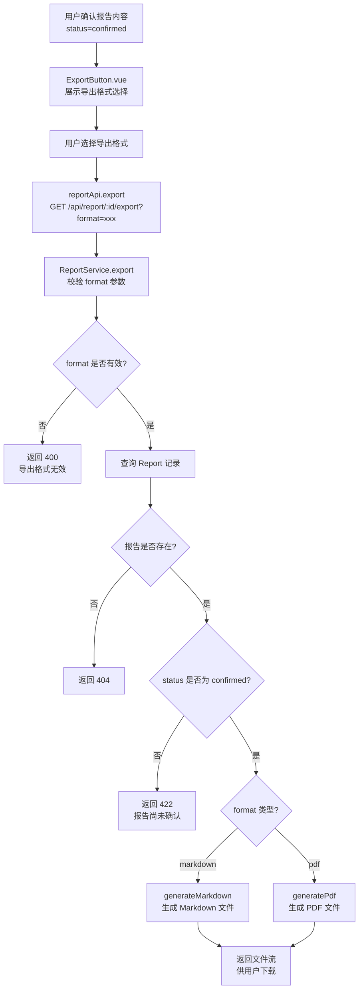
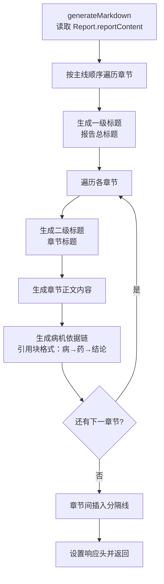
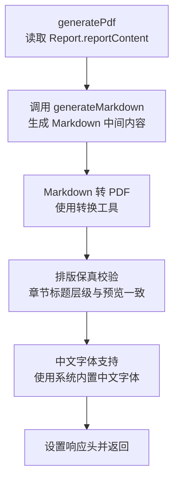
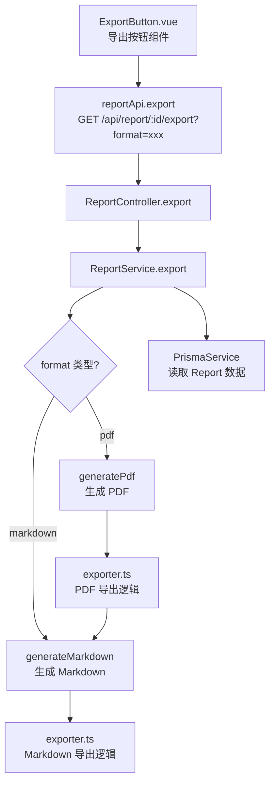

# 报告导出

> PRD Reference: docs/PRD/07. 论断报告模块/02. 报告导出/报告导出.md#报告导出

## 1. 业务流程

### 1.1 报告导出主流程

**触发**：用户在报告预览页确认报告内容后，选择导出格式并下载报告文件。

**步骤**：

1. 用户在报告预览页确认报告内容（status 为 `"confirmed"`）。
2. 前端 `ExportButton.vue` 展示导出格式选择：Markdown / PDF。
3. 用户选择导出格式后，前端调用 `reportApi.export()` 发送 `GET /api/report/:id/export?format=xxx` 请求。
4. 后端 `ReportController.export()` 接收请求，`ReportService.export()` 执行导出生成：
   - 校验 `format` 参数是否为 `"markdown"` 或 `"pdf"`。
   - 查询 `Report` 记录，验证报告存在性。
   - 验证报告 `status` 为 `"confirmed"`，未确认则返回 422。
   - 根据 `format` 参数调用对应的导出逻辑：
     - `format=markdown`：调用 `generateMarkdown()` 生成 Markdown 格式文件。
     - `format=pdf`：调用 `generatePdf()` 生成 PDF 格式文件。
5. 返回对应格式的文件流供用户下载。

**预期结果**：用户可下载与预览内容一致的 Markdown 或 PDF 格式报告文件，章节标题层级、论断内容排版与病机依据链完整保留。



### 1.2 Markdown 导出生成流程

**触发**：用户选择 Markdown 格式导出。

**步骤**：

1. `generateMarkdown()` 从 `Report.reportContent` 中读取各章节内容。
2. 按"辨病→论药→断吉凶"主线顺序编排章节标题与内容：
   - 一级标题为报告总标题。
   - 二级标题为各章节标题。
   - 每条论断下方附加病机依据链（病→药→结论），以引用块格式展示。
3. 章节之间使用分隔线保持视觉清晰。
4. 生成完整的 Markdown 文本，设置响应头 `Content-Type: text/markdown; charset=utf-8` 与 `Content-Disposition: attachment; filename="report-{id}.md"`。
5. 返回 Markdown 文件流。

**预期结果**：生成格式规范、排版清晰的 Markdown 报告文件，保留完整的章节层级与病机依据链。



### 1.3 PDF 导出生成流程

**触发**：用户选择 PDF 格式导出。

**步骤**：

1. `generatePdf()` 先调用 `generateMarkdown()` 生成 Markdown 中间内容。
2. 将 Markdown 内容转换为 PDF 格式：
   - 使用 Markdown-to-PDF 转换工具（如 `md-to-pdf` 或同类库）。
   - PDF 排版保持章节标题层级、论断内容与病机依据链与预览一致。
   - 中文字体支持：使用系统内置中文字体（思源黑体或系统默认中文字体）。
3. 设置响应头 `Content-Type: application/pdf` 与 `Content-Disposition: attachment; filename="report-{id}.pdf"`。
4. 返回 PDF 文件流。

**预期结果**：生成排版保真的 PDF 报告文件，章节标题层级、论断内容与病机依据链与预览一致，中文显示正常。



## 2. 关键函数设计

### 2.1 ReportService.export

```typescript
function export(reportId: number, format: "markdown" | "pdf"): ExportResult
```

- **职责**：根据报告 ID 与导出格式生成对应格式的报告文件供下载。
- **核心逻辑**：
  1. 校验 `format` 参数是否为 `"markdown"` 或 `"pdf"`。
  2. 查询 `Report` 记录，验证报告存在性。
  3. 验证 `status` 为 `"confirmed"`，未确认则返回 422 错误。
  4. 根据 `format` 参数调用对应导出逻辑：
     - `"markdown"`：调用 `generateMarkdown()` 生成 Markdown 文件。
     - `"pdf"`：调用 `generatePdf()` 生成 PDF 文件。
  5. 设置响应头并返回文件流。
- **PRD 追溯**：选择导出格式、系统生成格式文件、下载导出文件 — FR-08

### 2.2 generateMarkdown

```typescript
function generateMarkdown(reportContent: ReportContent): string
```

- **职责**：将报告内容转换为 Markdown 格式文本。
- **核心逻辑**：
  1. 从 `reportContent` 中按主线顺序遍历各章节。
  2. 为每个章节生成二级标题与正文内容。
  3. 为每条论断生成病机依据链引用块（`> 病：... → 药：... → 结论：...`）。
  4. 章节之间使用分隔线（`---`）。
  5. 返回完整的 Markdown 文本。
- **PRD 追溯**：系统生成 Markdown 格式报告文件 — FR-08

### 2.3 generatePdf

```typescript
function generatePdf(reportContent: ReportContent): Buffer
```

- **职责**：将报告内容转换为 PDF 格式二进制流。
- **核心逻辑**：
  1. 先调用 `generateMarkdown()` 生成 Markdown 中间内容。
  2. 使用 Markdown-to-PDF 转换工具将 Markdown 转换为 PDF。
  3. 确保 PDF 排版与预览一致：章节标题层级、论断内容、病机依据链完整保留。
  4. 确保中文字体正常显示（使用系统内置中文字体）。
  5. 返回 PDF 二进制流。
- **PRD 追溯**：系统生成 PDF 格式报告文件 — FR-08

## 3. 组件架构



## 4. 数据来源

- Markdown/PDF 导出工具：`code/backend/src/modules/report/lib/exporter.ts`
- 报告内容数据：`Report` 数据表的 `reportContent` JSON 字段
- 术语定义：`0.common/glossary.md`（病机、用神喜忌、辨病论断等术语）