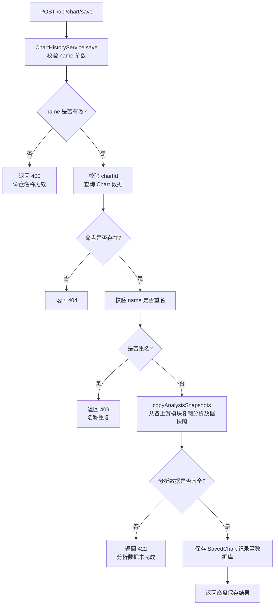
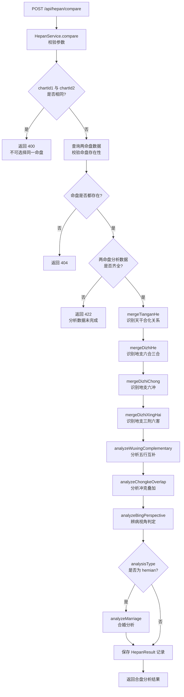

# API 设计 — 08. 命盘历史与比较模块

## 概述

本模块提供六组 REST API，支撑命盘保存管理与合盘合婚分析两个子模块的前后端交互。根据 `code-structure.md §4` 与 `§5.9`，本模块包含命盘保存、命盘列表、命盘详情、命盘重命名、命盘删除与合盘比较六个端点。所有端点遵循 `code-structure.md §4` 的路径与处理器约定，错误响应遵循 ADR-003（RFC7807 `application/problem+json`），分页遵循 ADR-005（cursor 分页）。

## 1. 子模块 API 汇总

### 1.1 命盘保存管理

| 方法 | 路径 | PRD 业务功能 | 说明 |
|------|------|-------------|------|
| POST | `/api/chart/save` | 为当前排盘结果指定命盘名称、将命盘完整数据保存为命盘记录、保存成功后给出提示 | 将当前命盘及其分析数据保存为命盘历史记录 |
| GET | `/api/chart/history` | 查看已保存的命盘列表、每条命盘记录显示命盘名称、性别、出生日期、四柱概要 | 以 cursor 分页方式返回命盘历史列表 |
| GET | `/api/chart/history/:id` | 查看已保存命盘的完整排盘结果、查看命盘的五行统计与十神标注、查看命盘的病机清单与用神喜忌 | 返回指定命盘历史记录的完整快照数据 |
| PATCH | `/api/chart/history/:id` | 修改命盘名称 | 更新命盘历史记录的名称 |
| DELETE | `/api/chart/history/:id` | 删除命盘记录 | 软删除指定命盘历史记录 |

### 1.2 合盘与合婚分析

| 方法 | 路径 | PRD 业务功能 | 说明 |
|------|------|-------------|------|
| POST | `/api/hepan/compare` | 选择第一个命盘、选择第二个命盘、确认后发起合盘比较、查看五行互补与冲克关系、查看辨病视角结论、查看婚姻匹配度综合评估结论 | 对两个命盘进行合盘或合婚分析，返回天干合化、地支合冲刑害、五行互补、冲克叠加、辨病视角与合婚分析结果 |

## 2. 端点详情

### 2.1 POST /api/chart/save

**处理器**：`ChartHistoryController.save()`
**服务**：`ChartHistoryService`
**PRD 追溯**：为当前排盘结果指定命盘名称、将命盘完整数据保存为命盘记录、保存成功后给出提示

#### 请求

| 字段 | 类型 | 必填 | 约束 | 示例 |
|------|------|------|------|------|
| chartId | Int | 是 | 有效命盘 ID | `1` |
| name | String | 是 | 命盘名称，1–50 字符，不可与已有命盘重名 | `"张三命盘"` |

#### 响应（200 OK）

| 字段 | 类型 | 说明 | 示例 |
|------|------|------|------|
| id | Int | 命盘历史记录 ID | `1` |
| chartId | Int | 关联命盘 ID | `1` |
| name | String | 命盘名称 | `"张三命盘"` |
| gender | String | 性别 | `"male"` |
| birthDate | String (ISO 8601) | 公历出生日期时间 | `"1990-05-23T08:00:00Z"` |
| pillarSummary | Array | 四柱概要 | `[{"position":"year","heavenlyStem":"甲","earthlyBranch":"子"}]` |
| wuxingSnapshot | Object? | 五行统计快照 | 见 `00.database-design.md` |
| shishenSnapshot | Object? | 十神标注快照 | 见 `00.database-design.md` |
| bingSnapshot | Object? | 病机清单快照 | 见 `00.database-design.md` |
| yongshenSnapshot | Object? | 用神喜忌快照 | 见 `00.database-design.md` |
| hechongSnapshot | Object? | 合冲刑害快照 | 见 `00.database-design.md` |
| createdAt | String (ISO 8601) | 创建时间 | `"2024-01-01T00:00:00Z"` |

#### 错误响应

| HTTP 状态码 | 错误类型 | 说明 |
|------------|---------|------|
| 400 | `https://bazi.app/errors/invalid-name` | 命盘名称为空或超过 50 字符 |
| 404 | `https://bazi.app/errors/chart-not-found` | 命盘 ID 不存在 |
| 409 | `https://bazi.app/errors/duplicate-name` | 命盘名称与已有命盘重名 |
| 422 | `https://bazi.app/errors/analysis-not-ready` | 命盘分析数据尚未完成，无法保存完整快照 |
| 500 | `https://bazi.app/errors/save-failed` | 命盘保存内部错误 |

#### 流程图



### 2.2 GET /api/chart/history

**处理器**：`ChartHistoryController.list()`
**服务**：`ChartHistoryService`
**PRD 追溯**：查看已保存的命盘列表、每条命盘记录显示命盘名称、性别、出生日期、四柱概要

#### 请求

| 字段 | 类型 | 必填 | 约束 | 示例 |
|------|------|------|------|------|
| after | Int? | 否 | cursor 分页游标（上一页最后一条记录的 id），首次请求不传 | `10` |
| limit | Int? | 否 | 每页条数，默认 20，最大 100 | `20` |

#### 响应（200 OK）

| 字段 | 类型 | 说明 | 示例 |
|------|------|------|------|
| items | Array | 命盘历史列表（按 createdAt 倒序） | 见下方 |
| nextCursor | Int? | 下一页游标，无更多数据时为 `null` | `10` |
| hasMore | Boolean | 是否有更多数据 | `true` |

**items 元素结构**：

| 字段 | 类型 | 说明 | 示例 |
|------|------|------|------|
| id | Int | 命盘历史记录 ID | `1` |
| chartId | Int | 关联命盘 ID | `1` |
| name | String | 命盘名称 | `"张三命盘"` |
| gender | String | 性别 | `"male"` |
| birthDate | String (ISO 8601) | 公历出生日期时间 | `"1990-05-23T08:00:00Z"` |
| pillarSummary | Array | 四柱概要 | `[{"position":"year","heavenlyStem":"甲","earthlyBranch":"子"}]` |
| createdAt | String (ISO 8601) | 创建时间 | `"2024-01-01T00:00:00Z"` |

#### 错误响应

| HTTP 状态码 | 错误类型 | 说明 |
|------------|---------|------|
| 400 | `https://bazi.app/errors/invalid-cursor` | cursor 游标无效 |

### 2.3 GET /api/chart/history/:id

**处理器**：`ChartHistoryController.getDetail()`
**服务**：`ChartHistoryService`
**PRD 追溯**：查看已保存命盘的完整排盘结果、查看命盘的五行统计与十神标注、查看命盘的病机清单与用神喜忌

#### 请求

| 字段 | 类型 | 必填 | 约束 | 示例 |
|------|------|------|------|------|
| id | Int | 是 | 路径参数，有效命盘历史记录 ID | `1` |

#### 响应（200 OK）

返回完整的 SavedChart 记录，包含所有快照字段（wuxingSnapshot、shishenSnapshot、bingSnapshot、yongshenSnapshot、hechongSnapshot）。

| 字段 | 类型 | 说明 | 示例 |
|------|------|------|------|
| id | Int | 命盘历史记录 ID | `1` |
| chartId | Int | 关联命盘 ID | `1` |
| name | String | 命盘名称 | `"张三命盘"` |
| gender | String | 性别 | `"male"` |
| birthDate | String (ISO 8601) | 公历出生日期时间 | `"1990-05-23T08:00:00Z"` |
| pillarSummary | Array | 四柱概要 | 见 `00.database-design.md` |
| wuxingSnapshot | Object? | 五行统计快照 | 见 `00.database-design.md` |
| shishenSnapshot | Object? | 十神标注快照 | 见 `00.database-design.md` |
| bingSnapshot | Object? | 病机清单快照 | 见 `00.database-design.md` |
| yongshenSnapshot | Object? | 用神喜忌快照 | 见 `00.database-design.md` |
| hechongSnapshot | Object? | 合冲刑害快照 | 见 `00.database-design.md` |
| createdAt | String (ISO 8601) | 创建时间 | `"2024-01-01T00:00:00Z"` |
| updatedAt | String (ISO 8601) | 更新时间 | `"2024-01-01T01:00:00Z"` |

#### 错误响应

| HTTP 状态码 | 错误类型 | 说明 |
|------------|---------|------|
| 404 | `https://bazi.app/errors/saved-chart-not-found` | 命盘历史记录 ID 不存在 |

### 2.4 PATCH /api/chart/history/:id

**处理器**：`ChartHistoryController.rename()`
**服务**：`ChartHistoryService`
**PRD 追溯**：修改命盘名称

#### 请求

| 字段 | 类型 | 必填 | 约束 | 示例 |
|------|------|------|------|------|
| id | Int | 是 | 路径参数，有效命盘历史记录 ID | `1` |
| name | String | 是 | 新命盘名称，1–50 字符，不可与已有命盘重名 | `"张三命盘-改"` |

#### 响应（200 OK）

| 字段 | 类型 | 说明 | 示例 |
|------|------|------|------|
| id | Int | 命盘历史记录 ID | `1` |
| chartId | Int | 关联命盘 ID | `1` |
| name | String | 更新后的命盘名称 | `"张三命盘-改"` |
| updatedAt | String (ISO 8601) | 更新时间 | `"2024-01-01T02:00:00Z"` |

#### 错误响应

| HTTP 状态码 | 错误类型 | 说明 |
|------------|---------|------|
| 400 | `https://bazi.app/errors/invalid-name` | 命盘名称为空或超过 50 字符 |
| 404 | `https://bazi.app/errors/saved-chart-not-found` | 命盘历史记录 ID 不存在 |
| 409 | `https://bazi.app/errors/duplicate-name` | 新名称与已有命盘重名 |

### 2.5 DELETE /api/chart/history/:id

**处理器**：`ChartHistoryController.remove()`
**服务**：`ChartHistoryService`
**PRD 追溯**：删除命盘记录

#### 请求

| 字段 | 类型 | 必填 | 约束 | 示例 |
|------|------|------|------|------|
| id | Int | 是 | 路径参数，有效命盘历史记录 ID | `1` |

#### 响应（200 OK）

| 字段 | 类型 | 说明 | 示例 |
|------|------|------|------|
| id | Int | 已删除的命盘历史记录 ID | `1` |
| deletedAt | String (ISO 8601) | 软删除时间戳 | `"2024-01-01T03:00:00Z"` |

#### 错误响应

| HTTP 状态码 | 错误类型 | 说明 |
|------------|---------|------|
| 404 | `https://bazi.app/errors/saved-chart-not-found` | 命盘历史记录 ID 不存在 |

### 2.6 POST /api/hepan/compare

**处理器**：`HepanController.compare()`
**服务**：`HepanService`
**PRD 追溯**：选择第一个命盘、选择第二个命盘、确认后发起合盘比较、查看五行互补与冲克关系、查看辨病视角结论、查看婚姻匹配度综合评估结论

#### 请求

| 字段 | 类型 | 必填 | 约束 | 示例 |
|------|------|------|------|------|
| chartId1 | Int | 是 | 第一个命盘 ID（有效且已完成排盘与辨病分析） | `1` |
| chartId2 | Int | 是 | 第二个命盘 ID（有效且已完成排盘与辨病分析，不可与 chartId1 相同） | `2` |
| analysisType | String | 是 | 分析类型：`"hepan"`（合盘）/ `"hemian"`（合婚） | `"hepan"` |

#### 响应（200 OK）

| 字段 | 类型 | 说明 | 示例 |
|------|------|------|------|
| id | Int | 合盘结果 ID | `1` |
| chartId1 | Int | 甲方命盘 ID | `1` |
| chartId2 | Int | 乙方命盘 ID | `2` |
| analysisType | String | 分析类型 | `"hepan"` |
| tianganHeResults | Object | 天干合化结果 | 见 `00.database-design.md` |
| dizhiHeResults | Object | 地支六合三合结果 | 见 `00.database-design.md` |
| dizhiChongResults | Object | 地支六冲结果 | 见 `00.database-design.md` |
| dizhiXingHaiResults | Object | 地支三刑六害结果 | 见 `00.database-design.md` |
| wuxingComplementary | Object | 五行互补关系 | 见 `00.database-design.md` |
| chongkeOverlap | Object | 冲克叠加关系 | 见 `00.database-design.md` |
| bingPerspective | Object | 辨病视角结论 | 见 `00.database-design.md` |
| marriageAnalysis | Object? | 合婚分析（仅 analysisType 为 `"hemian"` 时有值） | 见 `00.database-design.md` |
| createdAt | String (ISO 8601) | 创建时间 | `"2024-01-01T00:00:00Z"` |

#### 错误响应

| HTTP 状态码 | 错误类型 | 说明 |
|------------|---------|------|
| 400 | `https://bazi.app/errors/same-chart` | chartId1 与 chartId2 相同 |
| 404 | `https://bazi.app/errors/chart-not-found` | 命盘 ID 不存在 |
| 422 | `https://bazi.app/errors/analysis-not-ready` | 命盘分析数据尚未完成（需先完成辨病分析） |
| 422 | `https://bazi.app/errors/invalid-analysis-type` | analysisType 参数无效 |
| 422 | `https://bazi.app/errors/hemian-requires-gender` | 合婚分析要求两命盘性别不同（一男一女） |
| 500 | `https://bazi.app/errors/hepan-compare-failed` | 合盘分析内部错误 |

#### 流程图



## 3. 数据模型映射

| 端点 | 读取表 | 写入表 | 说明 |
|------|--------|--------|------|
| `POST /api/chart/save` | Chart, Pillar, WuxingStat, DayMasterStrength, ShishenLabel, GejuPattern, BingMachine, YongShenJiXi, HechongRelation | SavedChart | 从各上游模块读取分析数据，保存为快照 |
| `GET /api/chart/history` | SavedChart | — | 以 cursor 分页方式返回命盘历史列表 |
| `GET /api/chart/history/:id` | SavedChart | — | 返回指定命盘历史记录的完整快照数据 |
| `PATCH /api/chart/history/:id` | SavedChart | SavedChart | 更新命盘名称 |
| `DELETE /api/chart/history/:id` | SavedChart | SavedChart | 软删除命盘历史记录 |
| `POST /api/hepan/compare` | Chart, Pillar, WuxingStat, DayMasterStrength, ShishenLabel, GejuPattern, HechongRelation, BingMachine, YongShenJiXi | HepanResult | 从两命盘及其分析数据计算合盘合婚结果 |

## 4. 错误处理总则

所有错误响应遵循 ADR-003（RFC7807 `application/problem+json`）：

```json
{
  "type": "https://bazi.app/errors/saved-chart-not-found",
  "title": "命盘历史记录不存在",
  "status": 404,
  "detail": "id=999 对应的命盘历史记录不存在"
}
```

| HTTP 状态码 | 适用场景 |
|------------|---------|
| 400 | 请求参数无效（名称为空/超长、两命盘相同、游标无效） |
| 404 | 命盘 ID 或命盘历史记录 ID 不存在 |
| 409 | 命盘名称重复 |
| 422 | 前置依赖数据尚未完成或分析类型参数无效 |
| 500 | 保存或分析内部错误 |

## 5. 跨模块依赖

| 依赖方向 | 说明 |
|----------|------|
| 本模块 → 模块 01（八字排盘与历法） | 通过 `chartId` 引用 Chart + Pillar 数据，获取四柱天干地支与排盘参数 |
| 本模块 → 模块 02（五行与十神） | 通过 `chartId` 引用 WuxingStat、DayMasterStrength、ShishenLabel、GejuPattern 数据，保存为快照或用于五行互补分析 |
| 本模块 → 模块 03（合冲刑害） | 通过 `chartId` 引用 HechongRelation 数据，保存为快照；合盘时用于识别两局之间的合冲刑害关系 |
| 本模块 → 模块 04（辨病与用神） | 通过 `chartId` 引用 BingMachine、YongShenJiXi 数据，保存为快照；合盘时用于辨病视角判定与用神喜忌分析 |
| 本模块 → 模块 07（论断报告） | 命盘历史可关联论断报告（架构契约 `ChartHistory 1→N Report`） |