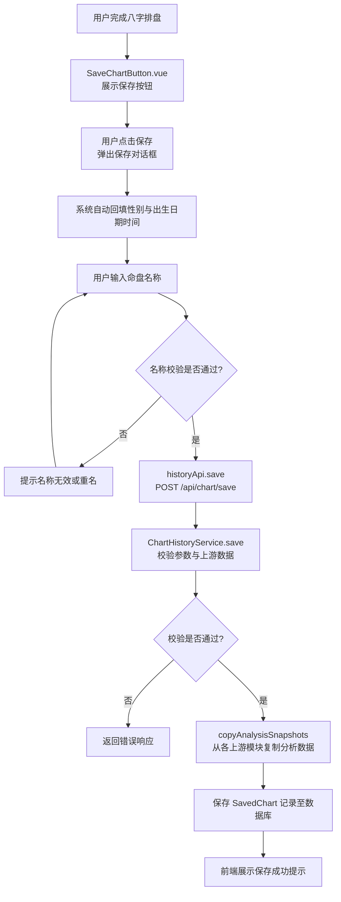
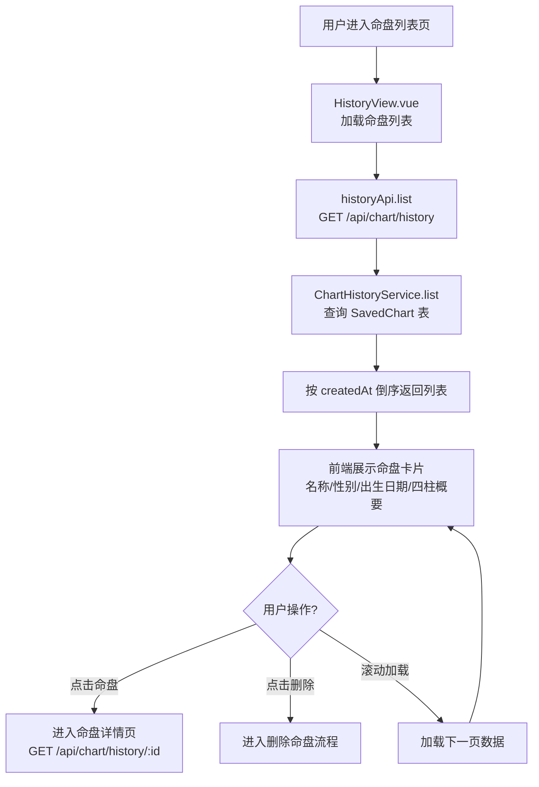
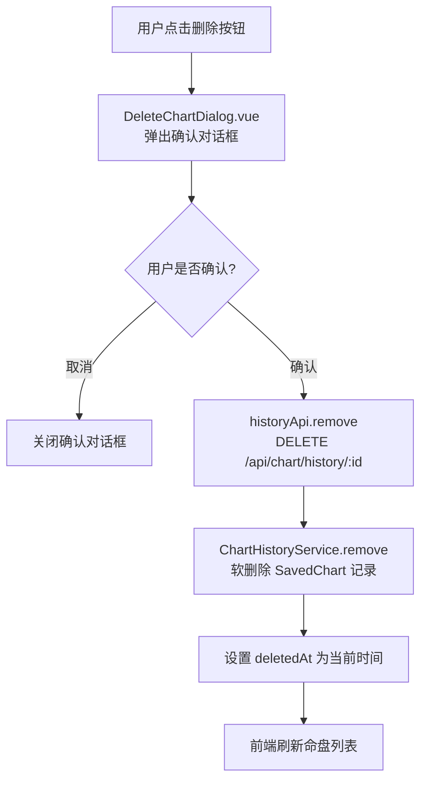
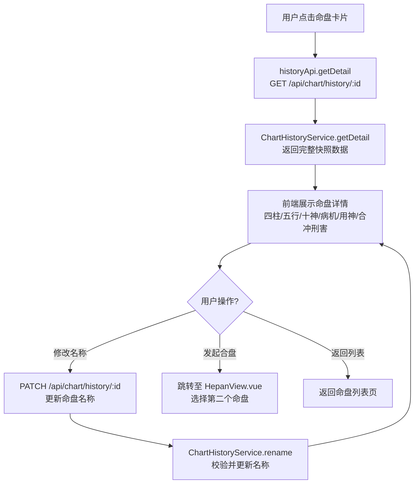
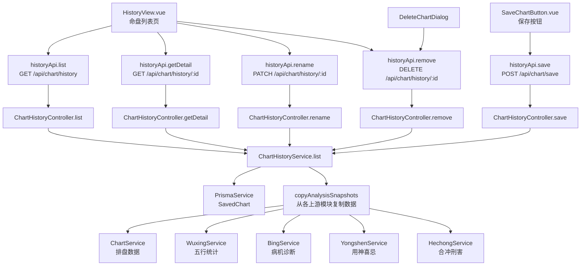

# 命盘保存管理

> PRD Reference: docs/PRD/08. 命盘历史与比较模块/01. 命盘保存管理/命盘保存管理.md#命盘保存管理

## 1. 业务流程

### 1.1 保存命盘主流程

**触发**：用户在排盘结果页点击保存命盘按钮，弹出保存对话框。

**步骤**：

1. 用户完成八字排盘后，前端 `SaveChartButton.vue` 展示保存按钮。
2. 用户点击保存按钮，前端弹出保存对话框，自动回填性别与出生日期时间（从当前排盘数据获取）。
3. 用户输入命盘名称，前端校验名称不为空且不超过 50 字符。
4. 用户确认保存，前端调用 `historyApi.save()` 发送 `POST /api/chart/save` 请求，传入 `chartId` 与 `name`。
5. 后端 `ChartHistoryController.save()` 接收请求，`ChartHistoryService.save()` 执行保存：
   - 校验 `name` 参数：不为空且不超过 50 字符。
   - 校验 `chartId` 对应的命盘存在性。
   - 校验 `name` 是否与已有命盘重名。
   - 从各上游模块读取分析数据，复制为快照字段。
6. 保存 `SavedChart` 记录至数据库。
7. 前端展示保存成功提示。

**预期结果**：命盘及其分析数据被保存为历史记录，用户可在命盘列表中查看。



### 1.2 命盘列表查看流程

**触发**：用户进入命盘列表页 `/history`。

**步骤**：

1. 前端 `HistoryView.vue` 加载，调用 `historyApi.list()` 发送 `GET /api/chart/history` 请求，使用 cursor 分页获取命盘历史列表。
2. 后端 `ChartHistoryService.list()` 查询 `SavedChart` 表，按 `createdAt` 倒序返回列表数据。
3. 前端按保存时间倒序展示命盘卡片，每张卡片显示命盘名称、性别、出生日期与四柱概要。
4. 用户可点击某条命盘进入详情页，或点击删除按钮触发删除流程。
5. 前端支持无限滚动或翻页加载更多数据。

**预期结果**：用户可查看已保存的命盘列表，每条记录展示关键摘要信息。



### 1.3 删除命盘流程

**触发**：用户在命盘列表页点击删除按钮。

**步骤**：

1. 用户在命盘列表页选择某个命盘，点击删除按钮。
2. 前端 `DeleteChartDialog.vue` 弹出确认对话框，提示用户确认删除。
3. 用户确认删除后，前端调用 `historyApi.remove()` 发送 `DELETE /api/chart/history/:id` 请求。
4. 后端 `ChartHistoryService.remove()` 执行软删除：设置 `deletedAt` 为当前 UTC 时间戳。
5. 前端刷新命盘列表，移除已删除的命盘记录。

**预期结果**：命盘记录被软删除，列表即时刷新。



### 1.4 命盘详情与重命名流程

**触发**：用户在命盘列表页点击某个命盘，进入详情页。

**步骤**：

1. 用户在命盘列表页点击某条命盘，前端调用 `GET /api/chart/history/:id` 获取完整快照数据。
2. 后端 `ChartHistoryService.getDetail()` 返回 `SavedChart` 的全部快照字段。
3. 前端展示命盘详情：四柱数据、五行统计、十神标注、病机清单、用神喜忌、合冲刑害。
4. 用户可修改命盘名称（前端 `HistoryView.vue` 内嵌编辑），修改后自动保存：
   - 前端调用 `PATCH /api/chart/history/:id` 请求，传入新 `name`。
   - 后端 `ChartHistoryService.rename()` 校验新名称并更新数据库。
5. 用户可从详情页发起合盘或合婚比较（跳转至 `/hepan` 页面）。

**预期结果**：用户可查看已保存命盘的完整排盘结果，修改名称，发起合盘比较。



## 2. 关键函数设计

### 2.1 ChartHistoryService.save

```typescript
function save(chartId: number, name: string): SavedChartResult
```

- **职责**：将指定命盘及其分析数据保存为命盘历史记录。
- **核心逻辑**：
  1. 校验 `name` 参数：不为空且不超过 50 字符。
  2. 通过 `chartId` 查询 `Chart` 数据，验证命盘存在性。
  3. 校验 `name` 是否与已有命盘重名（排除已软删除的记录）。
  4. 调用 `copyAnalysisSnapshots()` 从各上游模块读取分析数据并复制为快照：
     - 从 `Pillar` 表读取四柱数据，组装 `pillarSummary`。
     - 从 `WuxingStat` + `DayMasterStrength` 读取五行统计，组装 `wuxingSnapshot`。
     - 从 `ShishenLabel` + `GejuPattern` 读取十神与格局，组装 `shishenSnapshot`。
     - 从 `BingMachine` 读取病机清单，组装 `bingSnapshot`。
     - 从 `YongShenJiXi` 读取用神喜忌，组装 `yongshenSnapshot`。
     - 从 `HechongRelation` 读取合冲刑害，组装 `hechongSnapshot`。
  5. 从 `Chart` 表复制 `gender` 与 `birthDate` 到 `SavedChart`。
  6. 保存 `SavedChart` 记录至数据库。
  7. 返回保存结果。
- **PRD 追溯**：为当前排盘结果指定命盘名称、将命盘完整数据保存为命盘记录 — FR-09

### 2.2 copyAnalysisSnapshots

```typescript
function copyAnalysisSnapshots(chartId: number): AnalysisSnapshots
```

- **职责**：从各上游模块读取分析数据并复制为快照。
- **核心逻辑**：
  1. 查询 `Pillar` 表获取四柱数据，组装 `pillarSummary` JSON。
  2. 查询 `WuxingStat` 与 `DayMasterStrength` 获取五行统计与日主旺衰。
  3. 查询 `ShishenLabel` 与 `GejuPattern` 获取十神标注与格局判定。
  4. 查询 `BingMachine` 获取病机清单。
  5. 查询 `YongShenJiXi` 获取用神喜忌。
  6. 查询 `HechongRelation` 获取合冲刑害关系。
  7. 组装各快照 JSON 并返回。
  8. 若某模块分析数据尚未完成，对应快照字段为 `null`，但保存操作仍可继续。
- **PRD 追溯**：保存内容包含排盘的全部结果数据 — FR-09

### 2.3 ChartHistoryService.list

```typescript
function list(cursor?: number, limit?: number): SavedChartListResult
```

- **职责**：以 cursor 分页方式返回命盘历史列表，按保存时间倒序。
- **核心逻辑**：
  1. 解析 `cursor` 与 `limit` 参数（默认 limit=20，最大 100）。
  2. 查询 `SavedChart` 表，条件为 `deletedAt IS NULL`。
  3. 若 `cursor` 有值，追加条件 `id < cursor`（ID 自增，倒序即 id 递减）。
  4. 按 `createdAt` 倒序（即 `id` 倒序）返回 `limit + 1` 条记录，判断 `hasMore`。
  5. 返回列表数据与下一页游标。
- **PRD 追溯**：查看已保存的命盘列表、每条命盘记录显示命盘名称、性别、出生日期、四柱概要 — FR-09

### 2.4 ChartHistoryService.getDetail

```typescript
function getDetail(savedChartId: number): SavedChartDetailResult
```

- **职责**：返回指定命盘历史记录的完整快照数据。
- **核心逻辑**：
  1. 查询 `SavedChart` 表，条件为 `id = savedChartId AND deletedAt IS NULL`。
  2. 若不存在，抛出 404 错误。
  3. 返回完整 `SavedChart` 记录，包含所有快照字段。
- **PRD 追溯**：查看已保存命盘的完整排盘结果、查看命盘的五行统计与十神标注、查看命盘的病机清单与用神喜忌 — FR-09

### 2.5 ChartHistoryService.rename

```typescript
function rename(savedChartId: number, newName: string): RenameResult
```

- **职责**：更新命盘历史记录的名称。
- **核心逻辑**：
  1. 校验 `newName`：不为空且不超过 50 字符。
  2. 查询 `SavedChart` 记录，验证存在性。
  3. 校验 `newName` 是否与已有命盘重名（排除自身与已软删除的记录）。
  4. 更新 `name` 字段并保存。
  5. 返回更新后的名称与时间戳。
- **PRD 追溯**：修改命盘名称、修改名称后自动保存 — FR-09

### 2.6 ChartHistoryService.remove

```typescript
function remove(savedChartId: number): RemoveResult
```

- **职责**：软删除指定命盘历史记录。
- **核心逻辑**：
  1. 查询 `SavedChart` 记录，验证存在性且未被软删除。
  2. 设置 `deletedAt` 为当前 UTC 时间戳（ADR-002 软删除）。
  3. 返回已删除记录 ID 与删除时间戳。
- **PRD 追溯**：删除命盘记录、删除前需用户二次确认 — FR-09

## 3. 组件架构



## 4. 数据来源

- 命盘保存管理服务：`code/backend/src/modules/history/history.service.ts`
- 排盘数据：通过 `chartId` 引用模块 01 的 `Chart` 与 `Pillar` 表
- 五行十神数据：通过 `chartId` 引用模块 02 的 `WuxingStat`、`DayMasterStrength`、`ShishenLabel`、`GejuPattern` 表
- 合冲刑害数据：通过 `chartId` 引用模块 03 的 `HechongRelation` 表
- 辨病用神数据：通过 `chartId` 引用模块 04 的 `BingMachine`、`YongShenJiXi` 表
- 术语定义：`0.common/glossary.md`（命盘记录、五行互补、冲克叠加等术语）