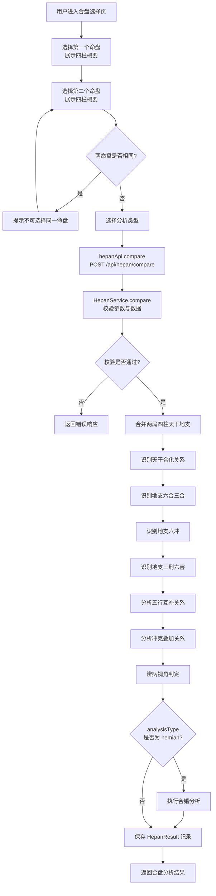
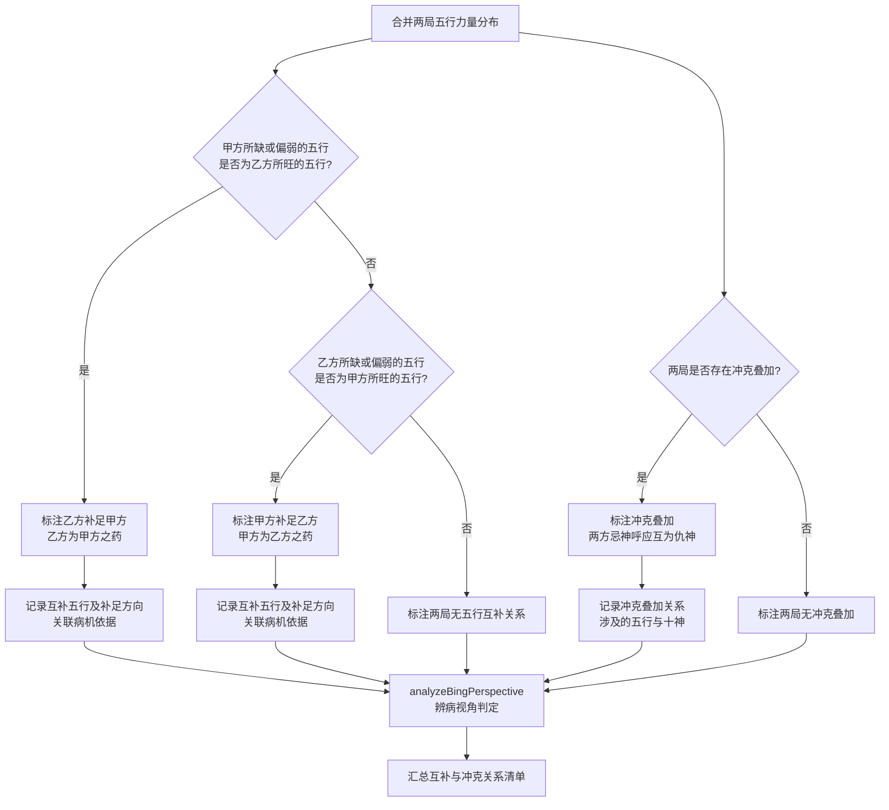
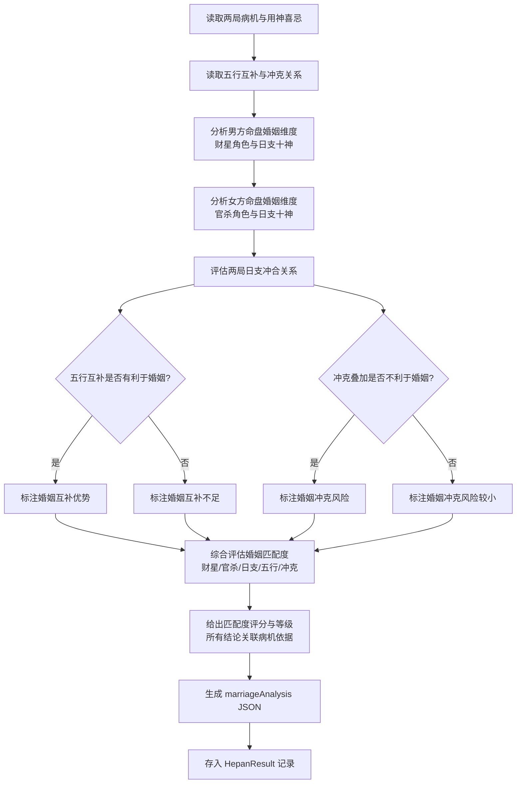
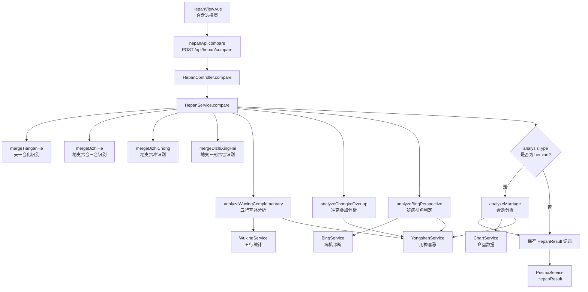

# 合盘与合婚分析

> PRD Reference: docs/PRD/08. 命盘历史与比较模块/02. 合盘与合婚分析/合盘与合婚分析.md#合盘与合婚分析

## 1. 业务流程

### 1.1 合盘分析主流程

**触发**：用户在命盘详情页点击合盘比较，或在合盘选择页选择两个命盘后确认合盘。

**步骤**：

1. 用户在命盘详情页或合盘选择页点击合盘比较，进入合盘选择页 `HepanView.vue`。
2. 用户从已保存命盘列表中选择第一个命盘，前端展示其四柱概要供确认。
3. 用户从已保存命盘列表中选择第二个命盘，前端展示其四柱概要供确认。
4. 前端校验两命盘不可为同一命盘，校验两命盘均已完成排盘与辨病分析。
5. 用户选择分析类型（`"hepan"` 合盘 / `"hemian"` 合婚），若选择合婚则校验两命盘性别不同。
6. 前端调用 `hepanApi.compare()` 发送 `POST /api/hepan/compare` 请求，传入 `chartId1`、`chartId2` 与 `analysisType`。
7. 后端 `HepanController.compare()` 接收请求，`HepanService.compare()` 执行合盘分析：
   - 校验 `chartId1` 与 `chartId2` 不相同。
   - 校验两命盘存在性及其分析数据完整性。
   - 若 `analysisType` 为 `"hemian"`，校验两命盘性别不同。
   - 合并两局四柱天干地支数据。
   - 依次执行天干合化、地支合冲刑害、五行互补、冲克叠加、辨病视角分析。
   - 若 `analysisType` 为 `"hemian"`，额外执行合婚分析。
8. 保存 `HepanResult` 记录至数据库。
9. 前端展示合盘分析结果。

**预期结果**：两命盘的合盘分析结果包含天干合化、地支合冲刑害、五行互补、冲克叠加与辨病视角结论，若选择合婚则额外包含婚姻匹配度评估。



### 1.2 五行互补与冲克分析流程

**触发**：合盘分析过程中，系统合并两局五行力量分布后执行。

**步骤**：

1. 系统合并两局五行力量分布（`WuxingStat` 数据）。
2. 执行五行互补分析：
   - 判断甲方所缺或偏弱的五行是否为乙方所旺的五行，若成立则标注乙方补足甲方（乙方为甲方之药）。
   - 判断乙方所缺或偏弱的五行是否为甲方所旺的五行，若成立则标注甲方补足乙方（甲方为乙方之药）。
   - 若两局均无互补关系，标注两局无五行互补。
3. 互补结论必须关联病机依据：从用神喜忌数据推导此方之病是否为彼方之药。
4. 执行冲克叠加分析：
   - 判断两局是否存在冲克叠加：两方忌神是否同方向叠加、互为仇神。
   - 若存在冲克叠加，标注冲克叠加关系及涉及的五行与十神。
   - 若不存在冲克叠加，标注两局无冲克叠加。
5. 执行辨病视角判定：
   - 综合五行互补与冲克叠加分析，从此方之病与彼方之药的对应关系判定。
   - 若此方之病恰为彼方之药，标注为"此方之病为彼方之药"。
   - 若两病叠加互为仇神，标注为"两病叠加互为仇神"。
   - 若无直接病药关系，标注为"无直接病药关系"。
6. 汇总互补与冲克关系清单，作为合盘分析结果的一部分。

**预期结果**：五行互补与冲克分析结论均有病机依据，标注补足方向与冲克叠加程度。



### 1.3 合婚分析流程

**触发**：用户在合盘分析结果页点击合婚分析，或直接选择分析类型为 `"hemian"`。

**步骤**：

1. 系统读取两局的病机清单（`BingMachine`）与用神喜忌（`YongShenJiXi`）。
2. 系统读取两局之间的五行互补与冲克关系（步骤 1.2 的分析结果）。
3. 从婚姻维度分析男方命盘：
   - 判断财星为用神或忌神，财星为用则配偶得力，财星为忌则婚姻不顺。
   - 判断日支所坐十神，日支为婚姻宫，所坐十神影响婚姻质量。
4. 从婚姻维度分析女方命盘：
   - 判断官杀为用神或忌神，官杀为用则配偶得力，官杀为忌则婚姻不顺。
   - 判断日支所坐十神。
5. 评估两局日支之间的冲合关系：
   - 日支为婚姻宫，两局日支之间的冲合关系直接影响婚姻和谐程度。
   - 日支相合则婚姻宫稳定，日支相冲则婚姻宫不稳。
6. 评估五行互补对婚姻的影响：
   - 若五行互补有利于婚姻（此方之病为彼方之药），标注互补优势。
   - 若五行互补不利于婚姻，标注互补不足。
7. 评估冲克叠加对婚姻的影响：
   - 若冲克叠加不利于婚姻（忌神叠加），标注冲克风险。
   - 若冲克叠加对婚姻影响较小，标注风险较小。
8. 综合评估婚姻匹配度：
   - 综合财星/官杀角色、日支关系、五行互补、冲克叠加四个维度。
   - 给出匹配度评分（0–100）与等级（优/良/中等/差）。
   - 所有结论必须有病机依据，不凭空断言。
9. 生成 `marriageAnalysis` JSON 并存入 `HepanResult`。

**预期结果**：合婚分析结果包含男方婚姻维度论断、女方婚姻维度论断、日支关系、五行互补影响、冲克风险与婚姻匹配度综合评估，所有结论有病机依据。



## 2. 关键函数设计

### 2.1 HepanService.compare

```typescript
function compare(chartId1: number, chartId2: number, analysisType: "hepan" | "hemian"): HepanResult
```

- **职责**：对两个命盘进行合盘或合婚分析，返回天干合化、地支合冲刑害、五行互补、冲克叠加、辨病视角与合婚分析结果。
- **核心逻辑**：
  1. 校验 `chartId1` 与 `chartId2` 不相同。
  2. 校验两命盘存在性及其分析数据完整性（需先完成辨病分析）。
  3. 若 `analysisType` 为 `"hemian"`，校验两命盘性别不同（一男一女）。
  4. 合并两局四柱天干地支数据。
  5. 调用 `mergeTianganHe()` 识别两局之间的天干合化关系。
  6. 调用 `mergeDizhiHe()` 识别两局之间的地支六合三合关系。
  7. 调用 `mergeDizhiChong()` 识别两局之间的地支六冲关系。
  8. 调用 `mergeDizhiXingHai()` 识别两局之间的地支三刑六害关系。
  9. 调用 `analyzeWuxingComplementary()` 分析五行互补关系。
  10. 调用 `analyzeChongkeOverlap()` 分析冲克叠加关系。
  11. 调用 `analyzeBingPerspective()` 从辨病视角判定此方之病与彼方之药。
  12. 若 `analysisType` 为 `"hemian"`，调用 `analyzeMarriage()` 执行合婚分析。
  13. 保存 `HepanResult` 记录至数据库。
  14. 返回合盘分析结果。
- **PRD 追溯**：选择第一个命盘、选择第二个命盘、确认后发起合盘比较 — FR-09

### 2.2 mergeTianganHe

```typescript
function mergeTianganHe(chart1: ChartData, chart2: ChartData): TianganHeResult
```

- **职责**：识别两局之间的天干合化关系。
- **核心逻辑**：
  1. 遍历甲方四柱天干与乙方四柱天干的所有组合。
  2. 对每组天干对，判断是否存在天干五合关系（甲己合化土、乙庚合化金、丙辛合化水、丁壬合化木、戊癸合化火）。
  3. 对每个合化关系，判断辨病影响：合绊用神（不利）或化解病机（有利）。
  4. 组装 `tianganHeResults` JSON 并返回。
- **PRD 追溯**：识别两局之间的天干合化关系 — FR-09

### 2.3 mergeDizhiHe

```typescript
function mergeDizhiHe(chart1: ChartData, chart2: ChartData): DizhiHeResult
```

- **职责**：识别两局之间的地支六合三合关系。
- **核心逻辑**：
  1. 遍历甲方四柱地支与乙方四柱地支的所有组合。
  2. 判断是否存在地支六合关系（子丑合、寅亥合等六组）。
  3. 判断是否存在跨局地支三合关系（如甲方申 + 乙方子 + 甲方辰 = 申子辰合水局）。
  4. 对每个合关系，判断辨病影响：合绊用神（不利）或化解病机（有利）。
  5. 组装 `dizhiHeResults` JSON 并返回。
- **PRD 追溯**：识别两局之间的地支六合三合关系 — FR-09

### 2.4 mergeDizhiChong

```typescript
function mergeDizhiChong(chart1: ChartData, chart2: ChartData): DizhiChongResult
```

- **职责**：识别两局之间的地支六冲关系。
- **核心逻辑**：
  1. 遍历甲方四柱地支与乙方四柱地支的所有组合。
  2. 判断是否存在地支六冲关系（子午冲、丑未冲等六组）。
  3. 对每个冲关系，判断辨病影响：冲克用神（不利）或冲去病星（有利）。
  4. 组装 `dizhiChongResults` JSON 并返回。
- **PRD 追溯**：识别两局之间的地支六冲关系 — FR-09

### 2.5 mergeDizhiXingHai

```typescript
function mergeDizhiXingHai(chart1: ChartData, chart2: ChartData): DizhiXingHaiResult
```

- **职责**：识别两局之间的地支三刑六害关系。
- **核心逻辑**：
  1. 遍历甲方四柱地支与乙方四柱地支的所有组合。
  2. 判断是否存在地支三刑关系（寅巳申、丑戌未、子卯等）。
  3. 判断是否存在地支六害关系（子未害、丑午害等六组）。
  4. 对每个刑害关系，判断辨病影响。
  5. 组装 `dizhiXingHaiResults` JSON 并返回。
- **PRD 追溯**：识别两局之间的地支三刑六害关系 — FR-09

### 2.6 analyzeWuxingComplementary

```typescript
function analyzeWuxingComplementary(chart1: ChartWithAnalysis, chart2: ChartWithAnalysis): WuxingComplementaryResult
```

- **职责**：分析两局之间的五行互补关系。
- **核心逻辑**：
  1. 读取两局的五行力量分布（`WuxingStat` 数据）。
  2. 遍历五行（金/木/水/火/土），对每一行判断：
     - 甲方该行力量偏弱或缺失，乙方该行力量偏旺 → 乙方补足甲方。
     - 乙方该行力量偏弱或缺失，甲方该行力量偏旺 → 甲方补足乙方。
  3. 结合用神喜忌数据（`YongShenJiXi`），判断互补关系是否为病药对应：
     - 此方之病（用神所缺五行）是否恰为彼方之药（彼方所旺五行）。
  4. 对每个互补对记录病机依据（从何病推出需何药，对方是否提供此药）。
  5. 组装 `wuxingComplementary` JSON 并返回。
- **PRD 追溯**：查看五行互补与冲克关系、查看辨病视角结论（此方之病是否为彼方之药） — FR-09

### 2.7 analyzeChongkeOverlap

```typescript
function analyzeChongkeOverlap(chart1: ChartWithAnalysis, chart2: ChartWithAnalysis): ChongkeOverlapResult
```

- **职责**：分析两局之间的冲克叠加关系。
- **核心逻辑**：
  1. 读取两局的用神喜忌数据（`YongShenJiXi`）。
  2. 遍历五行，对每一行判断：
     - 甲方该行为忌神且乙方该行也为忌神 → 两局忌神叠加，互为仇神。
     - 甲方该行为仇神且乙方该行也为仇神或忌神 → 间接加重病情。
  3. 结合冲克关系（天干冲、地支冲），判断冲克是否叠加在忌神方向上。
  4. 对每个叠加项记录严重程度（轻/中/重）。
  5. 组装 `chongkeOverlap` JSON 并返回。
- **PRD 追溯**：查看冲克叠加辨病结论（两方忌神是否呼应叠加、互为仇神） — FR-09

### 2.8 analyzeBingPerspective

```typescript
function analyzeBingPerspective(chart1: ChartWithAnalysis, chart2: ChartWithAnalysis, wuxingComplementary: WuxingComplementaryResult, chongkeOverlap: ChongkeOverlapResult): BingPerspectiveResult
```

- **职责**：从辨病视角判定此方之病与彼方之药的对应关系。
- **核心逻辑**：
  1. 综合五行互补与冲克叠加分析结果。
  2. 对甲方病机逐一判定：
     - 甲方之病是否由乙方之药补足 → 标注"此方之病为彼方之药"。
     - 甲方之病是否因乙方忌神叠加而加重 → 标注"两病叠加互为仇神"。
     - 甲方之病与乙方无直接病药关系 → 标注"无直接病药关系"。
  3. 对乙方病机逐一判定（同上逻辑，方向互换）。
  4. 组装 `bingPerspective` JSON 并返回。
- **PRD 追溯**：辨病视角纳入（此方之病是否为彼方之药） — FR-09

### 2.9 analyzeMarriage

```typescript
function analyzeMarriage(chart1: ChartWithAnalysis, chart2: ChartWithAnalysis, wuxingComplementary: WuxingComplementaryResult, chongkeOverlap: ChongkeOverlapResult): MarriageAnalysisResult
```

- **职责**：从婚姻维度分析两命盘的匹配度。
- **核心逻辑**：
  1. 确定男方与女方命盘（根据 `gender` 字段）。
  2. 分析男方婚姻维度：
     - 读取男方用神喜忌（`YongShenJiXi`），判断财星角色（用神/忌神）。
     - 读取男方日支所坐十神，判断婚姻宫状态。
  3. 分析女方婚姻维度：
     - 读取女方用神喜忌，判断官杀角色（用神/忌神）。
     - 读取女方日支所坐十神，判断婚姻宫状态。
  4. 评估两局日支之间的冲合关系（从 `dizhiChongResults` 与 `dizhiHeResults` 中提取）。
  5. 评估五行互补对婚姻的影响（从 `wuxingComplementary` 中提取）。
  6. 评估冲克叠加对婚姻的影响（从 `chongkeOverlap` 中提取）。
  7. 综合评估婚姻匹配度：给出评分（0–100）、等级（优/良/中等/差）与综合描述。
  8. 所有结论必须关联病机依据（PRD 业务规则：婚姻匹配度结论必须有病机依据）。
  9. 组装 `marriageAnalysis` JSON 并返回。
- **PRD 追溯**：查看婚姻匹配度综合评估结论、男看财星女看官杀、日支为婚姻宫、所有结论必须有病机依据 — FR-09

## 3. 组件架构



## 4. 数据来源

- 合盘分析逻辑：`code/backend/src/modules/history/lib/hepan-analyzer.ts`
- 命盘数据：通过 `chartId1` 与 `chartId2` 引用模块 01 的 `Chart` 与 `Pillar` 表
- 五行统计与日主旺衰：通过 `chartId` 引用模块 02 的 `WuxingStat` 与 `DayMasterStrength` 表
- 十神标注与格局判定：通过 `chartId` 引用模块 02 的 `ShishenLabel` 与 `GejuPattern` 表
- 合冲刑害数据：通过 `chartId` 引用模块 03 的 `HechongRelation` 表（单局合冲刑害规则复用于跨局识别）
- 病机诊断与用神喜忌：通过 `chartId` 引用模块 04 的 `BingMachine` 与 `YongShenJiXi` 表
- 术语定义：`0.common/glossary.md`（合盘、合婚、五行互补、冲克叠加、辨病视角等术语）